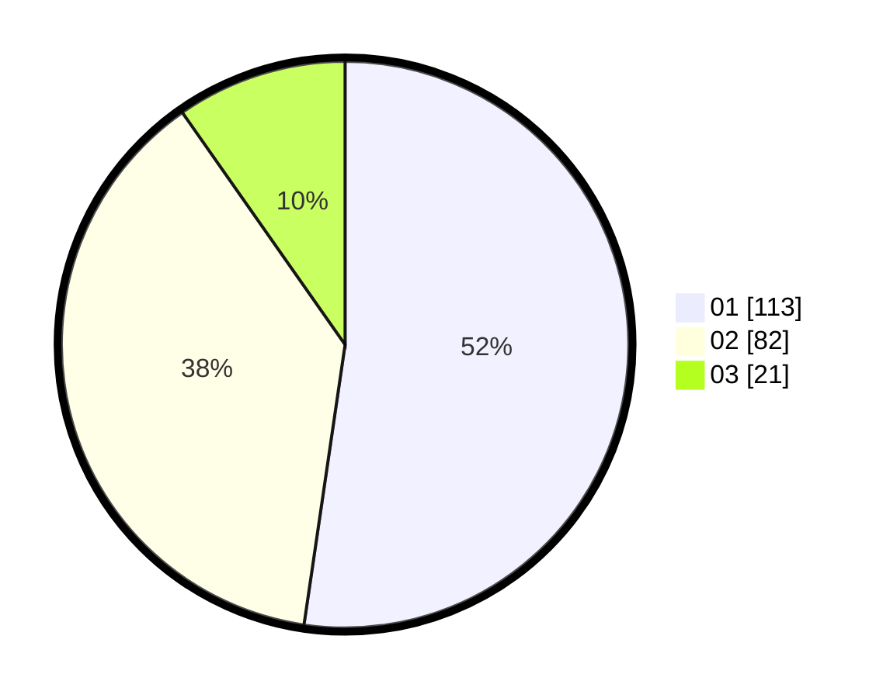

# Hasil

Hasil perolehan suara paslon dapat dilihat pada file paslon-01.txt, paslon-02.txt, dan paslon-03.txt.

Jika tidak ada, artinya data tersebut belum ada pada SIREKAP.

## Perolehan Suara

 * Paslon 01: **113**.
 * Paslon 02: **82**.
 * Paslon 03: **21**.

## Foto C Plano

https://sirekap-obj-formc.kpu.go.id/3cc7/pemilu/ppwp/31/75/09/10/05/3175091005033-20240215-221215--9a70a0c6-53ee-4769-b10b-5453d980e47e.jpg

https://sirekap-obj-formc.kpu.go.id/3cc7/pemilu/ppwp/31/75/09/10/05/3175091005033-20240215-221217--fe48c8b7-b955-4e48-b37e-c953234d670d.jpg

https://sirekap-obj-formc.kpu.go.id/3cc7/pemilu/ppwp/31/75/09/10/05/3175091005033-20240215-221217--722aa6ec-70dc-41eb-8167-0493b1e9fc70.jpg

## DATA PEMILIH TETAP

Jumlah pemilih dalam DPT: **256**.
 * L: **132**.
 * P: **124**.

## DATA PENGGUNA HAK PILIH

Jumlah pengguna hak pilih dalam DPT: **209**.
 * L: **106**.
 * P: **103**.

Jumlah pengguna hak pilih dalam DPTb: **1**.
 * L: **1**.
 * P: **0**.

Jumlah pengguna hak pilih dalam DPK: **10**.
 * L: **4**.
 * P: **6**.

Jumlah pengguna hak pilih: **220**.
 * L: **111**.
 * P: **109**.

## JUMLAH SUARA SAH DAN TIDAK SAH

JUMLAH SELURUH SUARA SAH: **216**.

JUMLAH SUARA TIDAK SAH: **4**.

JUMLAH SELURUH SUARA SAH DAN SUARA TIDAK SAH: **220**.
