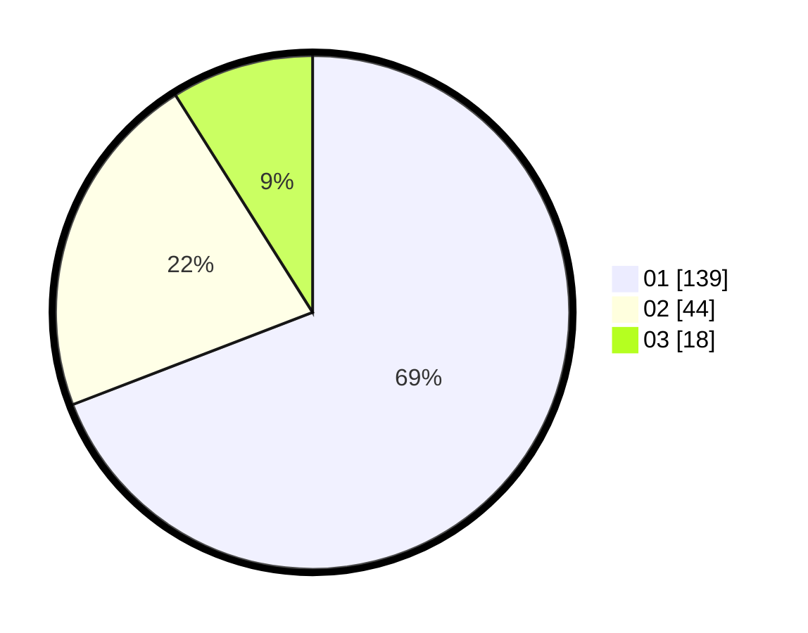

# Hasil

Hasil perolehan suara paslon dapat dilihat pada file paslon-01.txt, paslon-02.txt, dan paslon-03.txt.

Jika tidak ada, artinya data tersebut belum ada pada SIREKAP.

## Perolehan Suara

 * Paslon 01: **139**.
 * Paslon 02: **44**.
 * Paslon 03: **18**.

## Foto C Plano

https://sirekap-obj-formc.kpu.go.id/a6f7/pemilu/ppwp/31/75/09/10/05/3175091005039-20240214-162238--ce578652-e1ed-4449-932d-a6b6b4ddd8da.jpg

https://sirekap-obj-formc.kpu.go.id/a6f7/pemilu/ppwp/31/75/09/10/05/3175091005039-20240214-185820--f0c3593b-3785-4905-a0f5-4f5c5aa44032.jpg

https://sirekap-obj-formc.kpu.go.id/a6f7/pemilu/ppwp/31/75/09/10/05/3175091005039-20240214-185839--9395f171-9684-4f2f-87ef-d272c5670c33.jpg

## DATA PEMILIH TETAP

Jumlah pemilih dalam DPT: **256**.
 * L: **125**.
 * P: **131**.

## DATA PENGGUNA HAK PILIH

Jumlah pengguna hak pilih dalam DPT: **199**.
 * L: **94**.
 * P: **105**.

Jumlah pengguna hak pilih dalam DPTb: **2**.
 * L: **1**.
 * P: **1**.

Jumlah pengguna hak pilih dalam DPK: **2**.
 * L: **0**.
 * P: **2**.

Jumlah pengguna hak pilih: **203**.
 * L: **95**.
 * P: **108**.

## JUMLAH SUARA SAH DAN TIDAK SAH

JUMLAH SELURUH SUARA SAH: **201**.

JUMLAH SUARA TIDAK SAH: **2**.

JUMLAH SELURUH SUARA SAH DAN SUARA TIDAK SAH: **203**.
