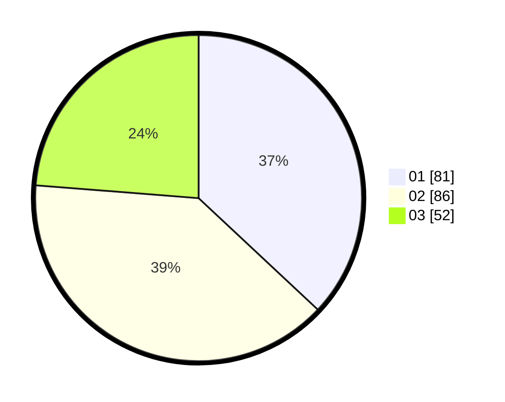

# Hasil

Hasil perolehan suara paslon dapat dilihat pada file paslon-01.txt, paslon-02.txt, dan paslon-03.txt.

Jika tidak ada, artinya data tersebut belum ada pada SIREKAP.

## Perolehan Suara

 * Paslon 01: **81**.
 * Paslon 02: **86**.
 * Paslon 03: **52**.

## Foto C Plano

https://sirekap-obj-formc.kpu.go.id/cc37/pemilu/ppwp/31/75/09/10/05/3175091005042-20240215-223229--0e99e6f8-2ae7-4515-b1a5-11d16d39682c.jpg

https://sirekap-obj-formc.kpu.go.id/cc37/pemilu/ppwp/31/75/09/10/05/3175091005042-20240215-230526--6556d076-d25b-4af7-8118-c5ee368e2f36.jpg

https://sirekap-obj-formc.kpu.go.id/cc37/pemilu/ppwp/31/75/09/10/05/3175091005042-20240215-223800--b8957767-b883-4ce6-be16-c48150a2a4f5.jpg

## DATA PEMILIH TETAP

Jumlah pemilih dalam DPT: **284**.
 * L: **135**.
 * P: **149**.

## DATA PENGGUNA HAK PILIH

Jumlah pengguna hak pilih dalam DPT: **219**.
 * L: **106**.
 * P: **113**.

Jumlah pengguna hak pilih dalam DPTb: **3**.
 * L: **3**.
 * P: **0**.

Jumlah pengguna hak pilih dalam DPK: **3**.
 * L: **2**.
 * P: **1**.

Jumlah pengguna hak pilih: **225**.
 * L: **111**.
 * P: **114**.

## JUMLAH SUARA SAH DAN TIDAK SAH

JUMLAH SELURUH SUARA SAH: **219**.

JUMLAH SUARA TIDAK SAH: **5**.

JUMLAH SELURUH SUARA SAH DAN SUARA TIDAK SAH: **224**.
