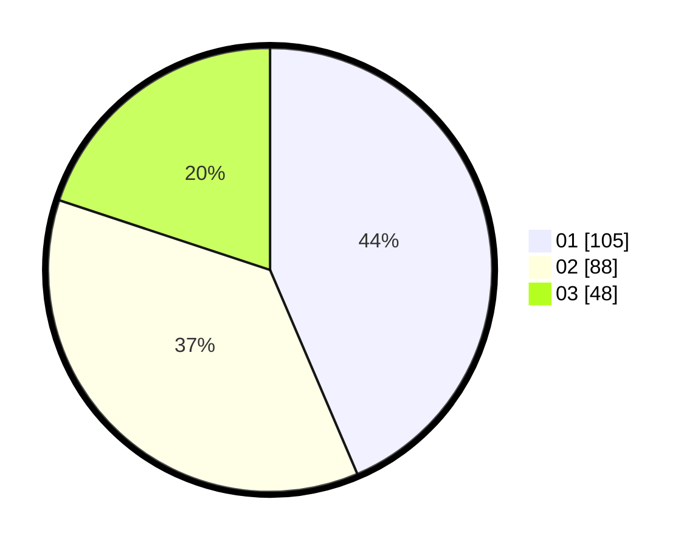

# Hasil

Hasil perolehan suara paslon dapat dilihat pada file paslon-01.txt, paslon-02.txt, dan paslon-03.txt.

Jika tidak ada, artinya data tersebut belum ada pada SIREKAP.

## Perolehan Suara

 * Paslon 01: **105**.
 * Paslon 02: **88**.
 * Paslon 03: **48**.

## Foto C Plano

https://sirekap-obj-formc.kpu.go.id/f6ab/pemilu/ppwp/31/75/09/10/05/3175091005044-20240215-023235--a8a8c7eb-e507-4264-9717-a2272076f24e.jpg

https://sirekap-obj-formc.kpu.go.id/f6ab/pemilu/ppwp/31/75/09/10/05/3175091005044-20240215-023323--d418da36-d2b5-4df4-9280-bd899a02def7.jpg

https://sirekap-obj-formc.kpu.go.id/f6ab/pemilu/ppwp/31/75/09/10/05/3175091005044-20240215-023353--54b92ef2-a2b7-43ba-af3e-3a7452df3756.jpg
