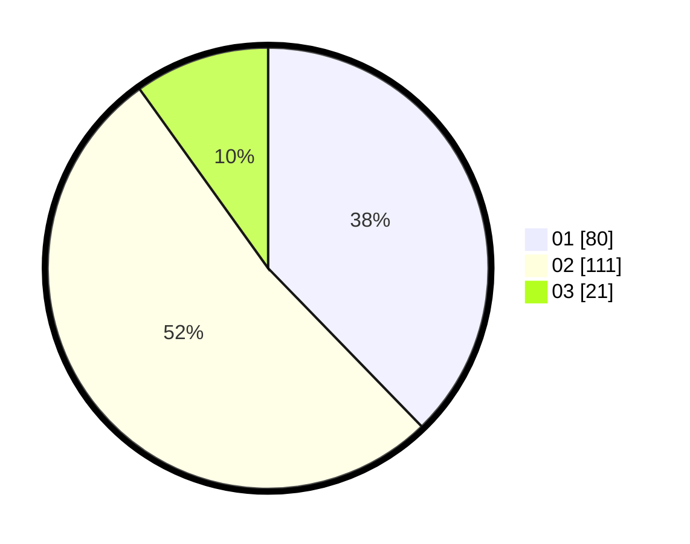

# Hasil

Hasil perolehan suara paslon dapat dilihat pada file paslon-01.txt, paslon-02.txt, dan paslon-03.txt.

Jika tidak ada, artinya data tersebut belum ada pada SIREKAP.

## Perolehan Suara

 * Paslon 01: **80**.
 * Paslon 02: **111**.
 * Paslon 03: **21**.

## Foto C Plano

https://sirekap-obj-formc.kpu.go.id/f04c/pemilu/ppwp/31/75/09/10/05/3175091005049-20240214-204205--d00e61bd-328f-445f-ba04-d493cece7340.jpg

https://sirekap-obj-formc.kpu.go.id/f04c/pemilu/ppwp/31/75/09/10/05/3175091005049-20240214-204229--df080709-45fa-4f1b-9f0f-6e6a270805c1.jpg
