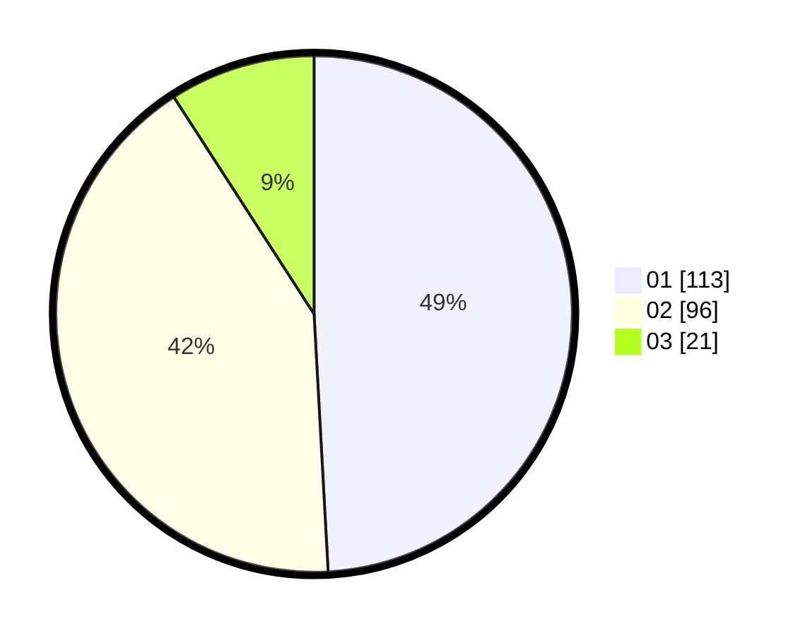

# Hasil

Hasil perolehan suara paslon dapat dilihat pada file paslon-01.txt, paslon-02.txt, dan paslon-03.txt.

Jika tidak ada, artinya data tersebut belum ada pada SIREKAP.

## Perolehan Suara

 * Paslon 01: **113**.
 * Paslon 02: **96**.
 * Paslon 03: **21**.

## Foto C Plano

https://sirekap-obj-formc.kpu.go.id/f951/pemilu/ppwp/31/75/09/10/05/3175091005063-20240216-005601--6d7c8685-e1cd-40a2-a9a9-e7c8a560abf9.jpg

https://sirekap-obj-formc.kpu.go.id/f951/pemilu/ppwp/31/75/09/10/05/3175091005063-20240216-005603--224a7370-2714-496c-8fc9-706d3bca7872.jpg

https://sirekap-obj-formc.kpu.go.id/f951/pemilu/ppwp/31/75/09/10/05/3175091005063-20240216-005602--a7f5b323-5b79-4d5b-a403-7b3a34395647.jpg

## DATA PEMILIH TETAP

Jumlah pemilih dalam DPT: **280**.
 * L: **147**.
 * P: **133**.

## DATA PENGGUNA HAK PILIH

Jumlah pengguna hak pilih dalam DPT: **228**.
 * L: **115**.
 * P: **113**.

Jumlah pengguna hak pilih dalam DPTb: **0**.
 * L: **0**.
 * P: **0**.

Jumlah pengguna hak pilih dalam DPK: **2**.
 * L: **0**.
 * P: **2**.

Jumlah pengguna hak pilih: **230**.
 * L: **115**.
 * P: **115**.

## JUMLAH SUARA SAH DAN TIDAK SAH

JUMLAH SELURUH SUARA SAH: **230**.

JUMLAH SUARA TIDAK SAH: **0**.

JUMLAH SELURUH SUARA SAH DAN SUARA TIDAK SAH: **230**.
