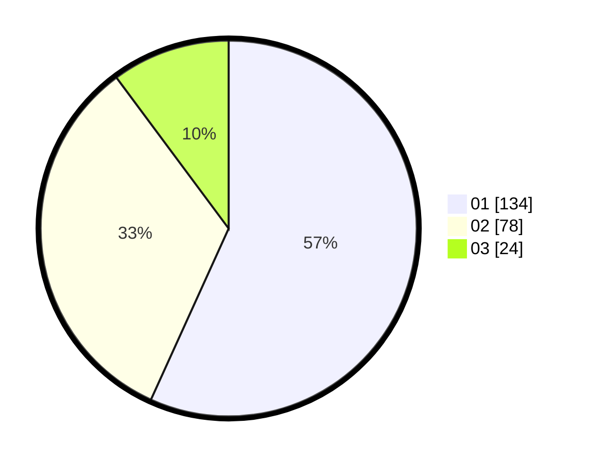

# Hasil

Hasil perolehan suara paslon dapat dilihat pada file paslon-01.txt, paslon-02.txt, dan paslon-03.txt.

Jika tidak ada, artinya data tersebut belum ada pada SIREKAP.

## Perolehan Suara

 * Paslon 01: **134**.
 * Paslon 02: **78**.
 * Paslon 03: **24**.

## Foto C Plano

https://sirekap-obj-formc.kpu.go.id/be31/pemilu/ppwp/31/75/09/10/05/3175091005064-20240216-001728--c45e0f24-2df9-4802-abaf-4b069f4929e7.jpg

https://sirekap-obj-formc.kpu.go.id/be31/pemilu/ppwp/31/75/09/10/05/3175091005064-20240216-001731--89f20c5d-5412-41cd-ac09-28d3ab503690.jpg

https://sirekap-obj-formc.kpu.go.id/be31/pemilu/ppwp/31/75/09/10/05/3175091005064-20240216-001729--392a6f0b-93d5-4ae5-893f-bc71aa6e620d.jpg

## DATA PEMILIH TETAP

Jumlah pemilih dalam DPT: **285**.
 * L: **140**.
 * P: **145**.

## DATA PENGGUNA HAK PILIH

Jumlah pengguna hak pilih dalam DPT: **237**.
 * L: **116**.
 * P: **121**.

Jumlah pengguna hak pilih dalam DPTb: **6**.
 * L: **1**.
 * P: **5**.

Jumlah pengguna hak pilih dalam DPK: **0**.
 * L: **0**.
 * P: **0**.

Jumlah pengguna hak pilih: **243**.
 * L: **117**.
 * P: **126**.

## JUMLAH SUARA SAH DAN TIDAK SAH

JUMLAH SELURUH SUARA SAH: **0**.

JUMLAH SUARA TIDAK SAH: **7**.

JUMLAH SELURUH SUARA SAH DAN SUARA TIDAK SAH: **0**.
