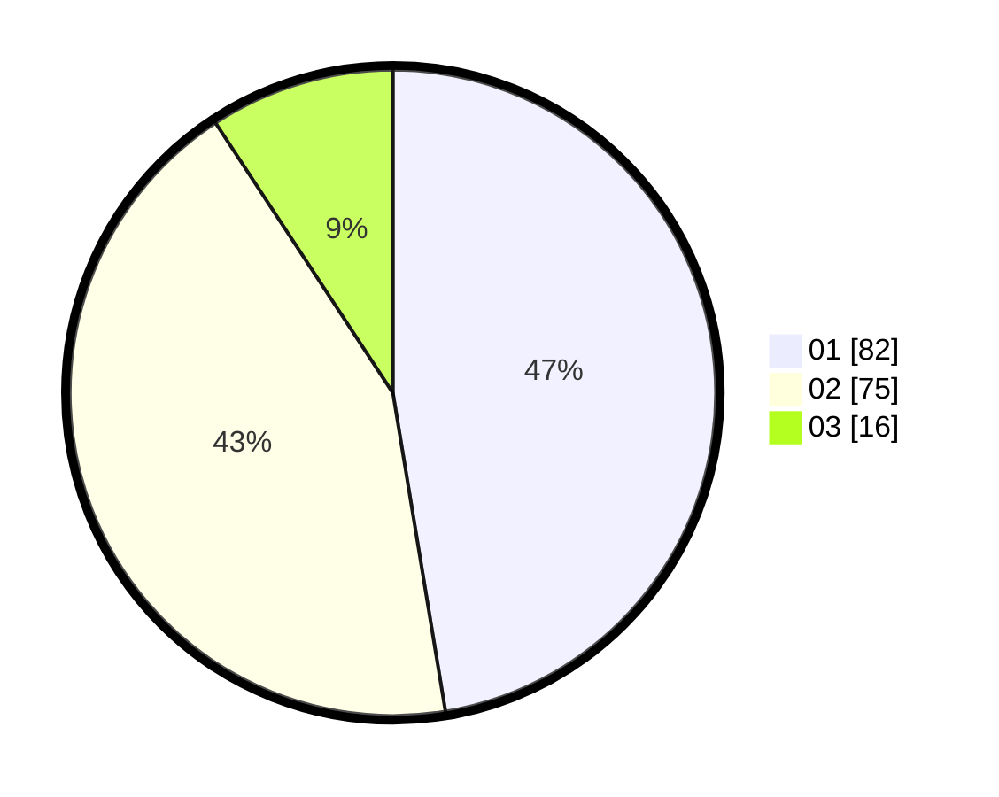

# Hasil

Hasil perolehan suara paslon dapat dilihat pada file paslon-01.txt, paslon-02.txt, dan paslon-03.txt.

Jika tidak ada, artinya data tersebut belum ada pada SIREKAP.

## Perolehan Suara

 * Paslon 01: **82**.
 * Paslon 02: **75**.
 * Paslon 03: **16**.

## Foto C Plano

https://sirekap-obj-formc.kpu.go.id/7281/pemilu/ppwp/31/75/09/10/05/3175091005068-20240214-223215--144bfff8-229f-457c-bb4f-6a4f4ccea087.jpg

https://sirekap-obj-formc.kpu.go.id/7281/pemilu/ppwp/31/75/09/10/05/3175091005068-20240214-223256--4eec0caf-626b-4fd5-af9f-f17ef42971c9.jpg
