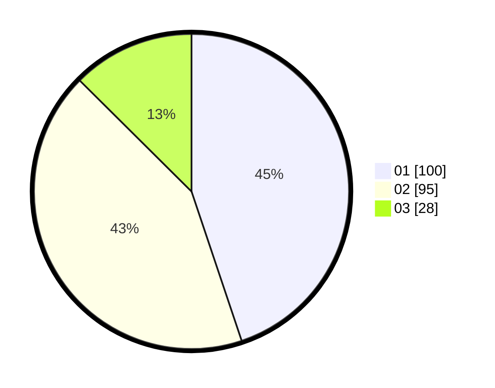

# Hasil

Hasil perolehan suara paslon dapat dilihat pada file paslon-01.txt, paslon-02.txt, dan paslon-03.txt.

Jika tidak ada, artinya data tersebut belum ada pada SIREKAP.

## Perolehan Suara

 * Paslon 01: **100**.
 * Paslon 02: **95**.
 * Paslon 03: **28**.

## Foto C Plano

https://sirekap-obj-formc.kpu.go.id/8239/pemilu/ppwp/31/75/09/10/05/3175091005074-20240216-132814--f23de12b-3df1-442d-98cb-7ba0d6287398.jpg

https://sirekap-obj-formc.kpu.go.id/8239/pemilu/ppwp/31/75/09/10/05/3175091005074-20240216-132815--3125f211-c0a8-41cc-b6ab-77653a64d1ea.jpg

https://sirekap-obj-formc.kpu.go.id/8239/pemilu/ppwp/31/75/09/10/05/3175091005074-20240216-132814--e026ee02-0aed-438c-9caa-ed753c67890f.jpg

## DATA PEMILIH TETAP

Jumlah pemilih dalam DPT: **286**.
 * L: **137**.
 * P: **149**.

## DATA PENGGUNA HAK PILIH

Jumlah pengguna hak pilih dalam DPT: **217**.
 * L: **100**.
 * P: **117**.

Jumlah pengguna hak pilih dalam DPTb: **4**.
 * L: **1**.
 * P: **3**.

Jumlah pengguna hak pilih dalam DPK: **3**.
 * L: **1**.
 * P: **2**.

Jumlah pengguna hak pilih: **224**.
 * L: **102**.
 * P: **122**.

## JUMLAH SUARA SAH DAN TIDAK SAH

JUMLAH SELURUH SUARA SAH: **223**.

JUMLAH SUARA TIDAK SAH: **1**.

JUMLAH SELURUH SUARA SAH DAN SUARA TIDAK SAH: **224**.
