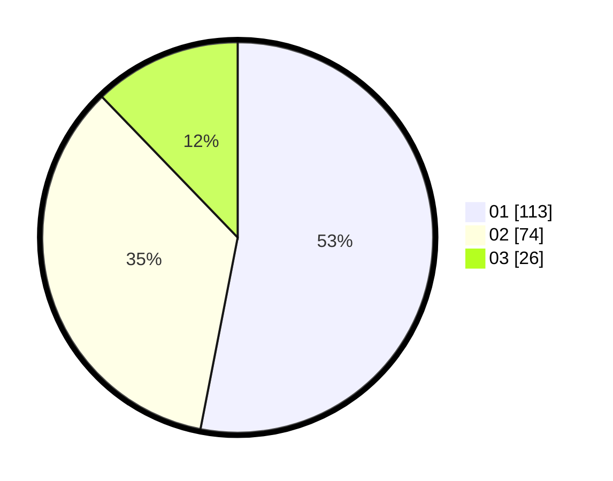

# Hasil

Hasil perolehan suara paslon dapat dilihat pada file paslon-01.txt, paslon-02.txt, dan paslon-03.txt.

Jika tidak ada, artinya data tersebut belum ada pada SIREKAP.

## Perolehan Suara

 * Paslon 01: **113**.
 * Paslon 02: **74**.
 * Paslon 03: **26**.

## Foto C Plano

https://sirekap-obj-formc.kpu.go.id/64a7/pemilu/ppwp/31/75/09/10/05/3175091005075-20240216-134900--0092915e-31d8-4f58-9f8a-97aa7ce5322e.jpg

https://sirekap-obj-formc.kpu.go.id/64a7/pemilu/ppwp/31/75/09/10/05/3175091005075-20240214-214328--778d2f79-1cd6-418c-b642-de504c47743d.jpg

https://sirekap-obj-formc.kpu.go.id/64a7/pemilu/ppwp/31/75/09/10/05/3175091005075-20240214-214500--c96ded57-3a5b-4a2e-b5e8-4f8f071e406e.jpg

## DATA PEMILIH TETAP

Jumlah pemilih dalam DPT: **288**.
 * L: **137**.
 * P: **151**.

## DATA PENGGUNA HAK PILIH

Jumlah pengguna hak pilih dalam DPT: **217**.
 * L: **103**.
 * P: **114**.

Jumlah pengguna hak pilih dalam DPTb: **0**.
 * L: **0**.
 * P: **0**.

Jumlah pengguna hak pilih dalam DPK: **0**.
 * L: **0**.
 * P: **0**.

Jumlah pengguna hak pilih: **217**.
 * L: **103**.
 * P: **114**.

## JUMLAH SUARA SAH DAN TIDAK SAH

JUMLAH SELURUH SUARA SAH: **213**.

JUMLAH SUARA TIDAK SAH: **4**.

JUMLAH SELURUH SUARA SAH DAN SUARA TIDAK SAH: **217**.
