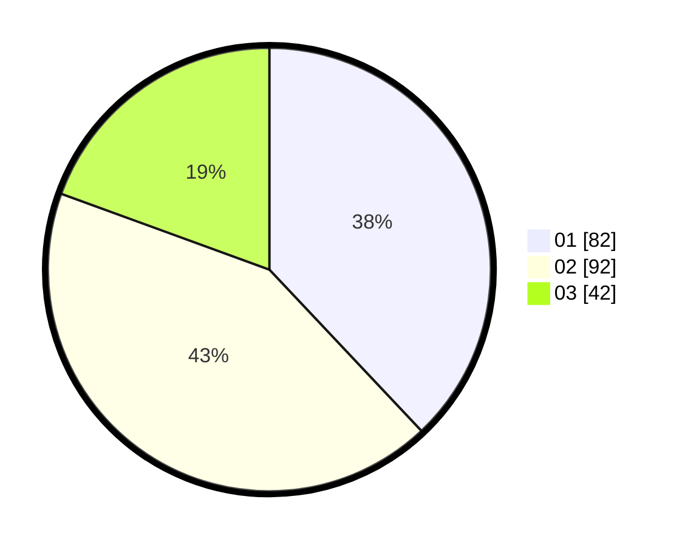

# Hasil

Hasil perolehan suara paslon dapat dilihat pada file paslon-01.txt, paslon-02.txt, dan paslon-03.txt.

Jika tidak ada, artinya data tersebut belum ada pada SIREKAP.

## Perolehan Suara

 * Paslon 01: **82**.
 * Paslon 02: **92**.
 * Paslon 03: **42**.

## Foto C Plano

https://sirekap-obj-formc.kpu.go.id/3e4f/pemilu/ppwp/31/75/09/10/05/3175091005080-20240214-215755--95d5b729-3b7a-41e9-b42b-52d23a6157a1.jpg

https://sirekap-obj-formc.kpu.go.id/3e4f/pemilu/ppwp/31/75/09/10/05/3175091005080-20240214-215917--b378a195-5e5e-4060-9682-a06b1b0c2ec9.jpg

https://sirekap-obj-formc.kpu.go.id/3e4f/pemilu/ppwp/31/75/09/10/05/3175091005080-20240214-220101--d98591b5-b1d7-47dd-91a7-942e2ce05715.jpg
