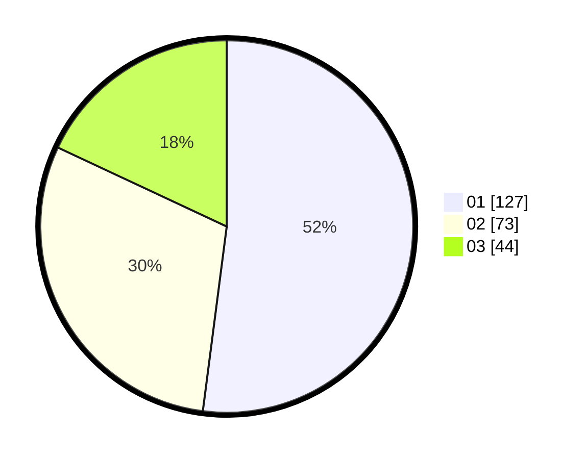

# Hasil

Hasil perolehan suara paslon dapat dilihat pada file paslon-01.txt, paslon-02.txt, dan paslon-03.txt.

Jika tidak ada, artinya data tersebut belum ada pada SIREKAP.

## Perolehan Suara

 * Paslon 01: **127**.
 * Paslon 02: **73**.
 * Paslon 03: **44**.

## Foto C Plano

https://sirekap-obj-formc.kpu.go.id/5334/pemilu/ppwp/31/75/09/10/05/3175091005082-20240214-234121--5d086f25-a494-4e6d-9a60-c08bf194cf4e.jpg

https://sirekap-obj-formc.kpu.go.id/5334/pemilu/ppwp/31/75/09/10/05/3175091005082-20240214-234206--4561728c-9cc9-4a65-82ad-918ff2e88900.jpg

https://sirekap-obj-formc.kpu.go.id/5334/pemilu/ppwp/31/75/09/10/05/3175091005082-20240214-234253--857843be-84b8-4e4e-b430-5e67942d9925.jpg

## DATA PEMILIH TETAP

Jumlah pemilih dalam DPT: **286**.
 * L: **144**.
 * P: **142**.

## DATA PENGGUNA HAK PILIH

Jumlah pengguna hak pilih dalam DPT: **233**.
 * L: **110**.
 * P: **123**.

Jumlah pengguna hak pilih dalam DPTb: **7**.
 * L: **4**.
 * P: **3**.

Jumlah pengguna hak pilih dalam DPK: **5**.
 * L: **3**.
 * P: **2**.

Jumlah pengguna hak pilih: **245**.
 * L: **117**.
 * P: **128**.

## JUMLAH SUARA SAH DAN TIDAK SAH

JUMLAH SELURUH SUARA SAH: **244**.

JUMLAH SUARA TIDAK SAH: **1**.

JUMLAH SELURUH SUARA SAH DAN SUARA TIDAK SAH: **245**.
