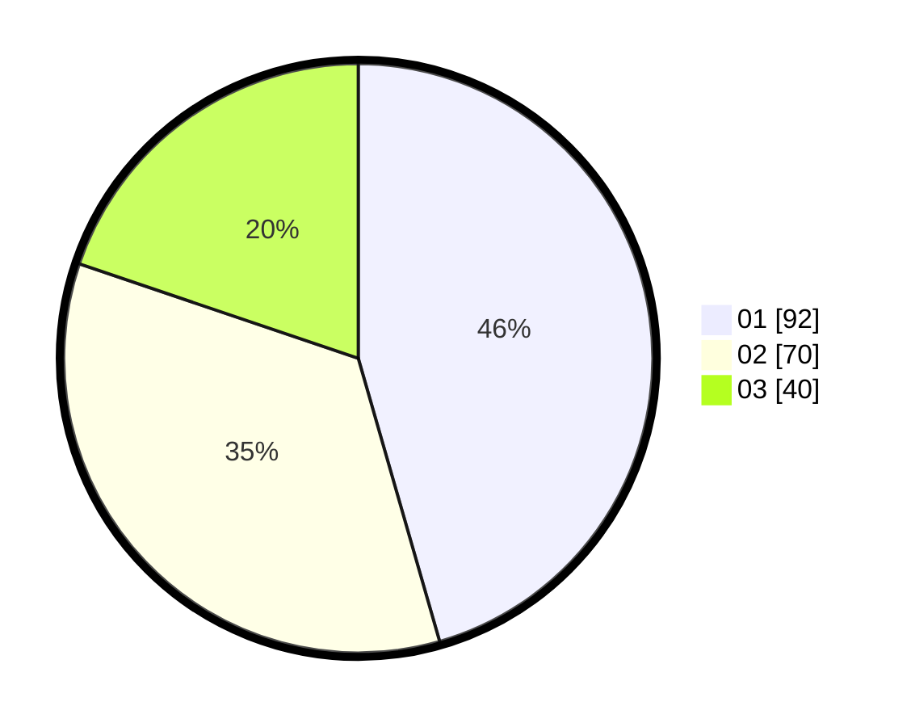

# Hasil

Hasil perolehan suara paslon dapat dilihat pada file paslon-01.txt, paslon-02.txt, dan paslon-03.txt.

Jika tidak ada, artinya data tersebut belum ada pada SIREKAP.

## Perolehan Suara

 * Paslon 01: **92**.
 * Paslon 02: **70**.
 * Paslon 03: **40**.

## Foto C Plano

https://sirekap-obj-formc.kpu.go.id/8c6b/pemilu/ppwp/31/75/09/10/05/3175091005086-20240217-041006--f8c74d89-5b32-4d41-af6b-72b0f03ac94e.jpg

https://sirekap-obj-formc.kpu.go.id/8c6b/pemilu/ppwp/31/75/09/10/05/3175091005086-20240217-043837--1c192fa7-464c-467c-b6bc-383857538317.jpg

https://sirekap-obj-formc.kpu.go.id/8c6b/pemilu/ppwp/31/75/09/10/05/3175091005086-20240217-052413--a97e9a21-3e86-474e-87eb-ef145bd73209.jpg
