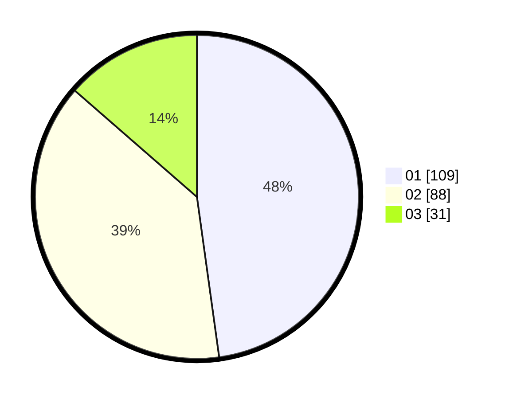

# Hasil

Hasil perolehan suara paslon dapat dilihat pada file paslon-01.txt, paslon-02.txt, dan paslon-03.txt.

Jika tidak ada, artinya data tersebut belum ada pada SIREKAP.

## Perolehan Suara

 * Paslon 01: **109**.
 * Paslon 02: **88**.
 * Paslon 03: **31**.

## Foto C Plano

https://sirekap-obj-formc.kpu.go.id/11fe/pemilu/ppwp/31/75/09/10/05/3175091005092-20240216-155405--37d890db-a8c9-443e-b29f-a3b4ea17c2cf.jpg

https://sirekap-obj-formc.kpu.go.id/11fe/pemilu/ppwp/31/75/09/10/05/3175091005092-20240216-155406--be1095eb-ced6-44f0-95fb-e56e8442b6b5.jpg

https://sirekap-obj-formc.kpu.go.id/11fe/pemilu/ppwp/31/75/09/10/05/3175091005092-20240216-155406--80ea0c0e-46cd-4d72-9636-f03991b11599.jpg

## DATA PEMILIH TETAP

Jumlah pemilih dalam DPT: **270**.
 * L: **137**.
 * P: **133**.

## DATA PENGGUNA HAK PILIH

Jumlah pengguna hak pilih dalam DPT: **227**.
 * L: **110**.
 * P: **117**.

Jumlah pengguna hak pilih dalam DPTb: **2**.
 * L: **1**.
 * P: **1**.

Jumlah pengguna hak pilih dalam DPK: **2**.
 * L: **1**.
 * P: **1**.

Jumlah pengguna hak pilih: **231**.
 * L: **112**.
 * P: **119**.

## JUMLAH SUARA SAH DAN TIDAK SAH

JUMLAH SELURUH SUARA SAH: **228**.

JUMLAH SUARA TIDAK SAH: **3**.

JUMLAH SELURUH SUARA SAH DAN SUARA TIDAK SAH: **231**.
