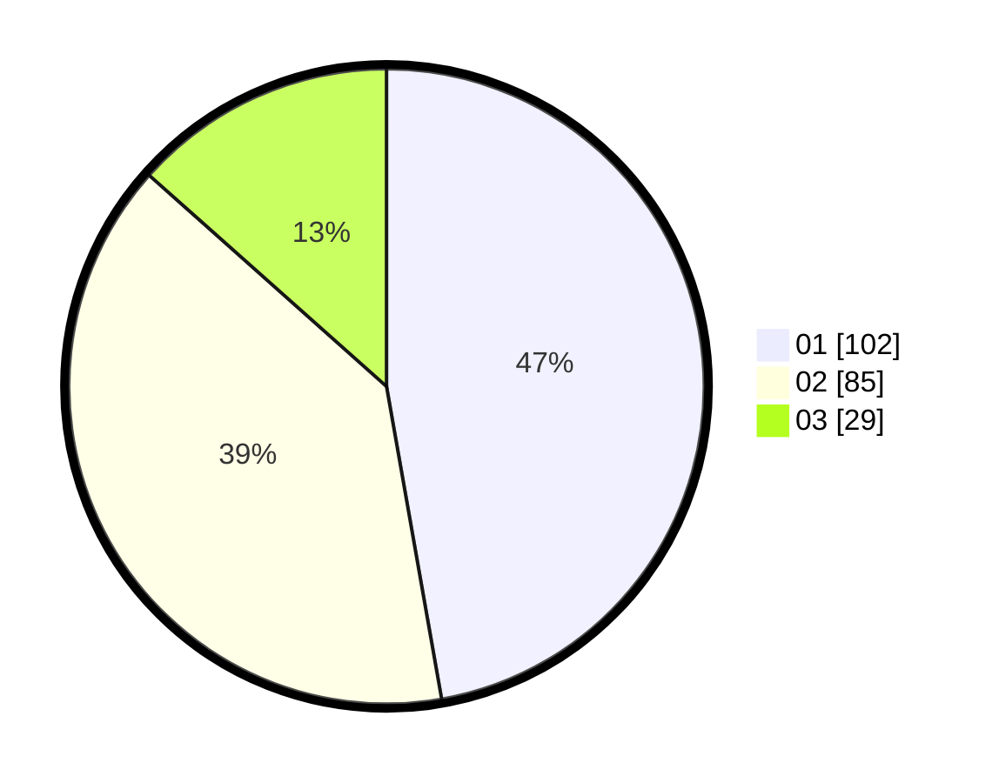

# Hasil

Hasil perolehan suara paslon dapat dilihat pada file paslon-01.txt, paslon-02.txt, dan paslon-03.txt.

Jika tidak ada, artinya data tersebut belum ada pada SIREKAP.

## Perolehan Suara

 * Paslon 01: **102**.
 * Paslon 02: **85**.
 * Paslon 03: **29**.

## Foto C Plano

https://sirekap-obj-formc.kpu.go.id/c6b5/pemilu/ppwp/31/75/09/10/05/3175091005099-20240216-005159--f170187b-6b63-47a8-8655-deb5a2c3d40a.jpg

https://sirekap-obj-formc.kpu.go.id/c6b5/pemilu/ppwp/31/75/09/10/05/3175091005099-20240216-052049--9062c722-51a7-49e4-93b6-af5797852b63.jpg

https://sirekap-obj-formc.kpu.go.id/c6b5/pemilu/ppwp/31/75/09/10/05/3175091005099-20240216-005201--39ab84a5-514d-4e1d-9717-71ca7178489a.jpg

## DATA PEMILIH TETAP

Jumlah pemilih dalam DPT: **260**.
 * L: **125**.
 * P: **135**.

## DATA PENGGUNA HAK PILIH

Jumlah pengguna hak pilih dalam DPT: **218**.
 * L: **102**.
 * P: **116**.

Jumlah pengguna hak pilih dalam DPTb: **1**.
 * L: **1**.
 * P: **0**.

Jumlah pengguna hak pilih dalam DPK: **0**.
 * L: **0**.
 * P: **0**.

Jumlah pengguna hak pilih: **219**.
 * L: **103**.
 * P: **116**.

## JUMLAH SUARA SAH DAN TIDAK SAH

JUMLAH SELURUH SUARA SAH: **216**.

JUMLAH SUARA TIDAK SAH: **3**.

JUMLAH SELURUH SUARA SAH DAN SUARA TIDAK SAH: **219**.
