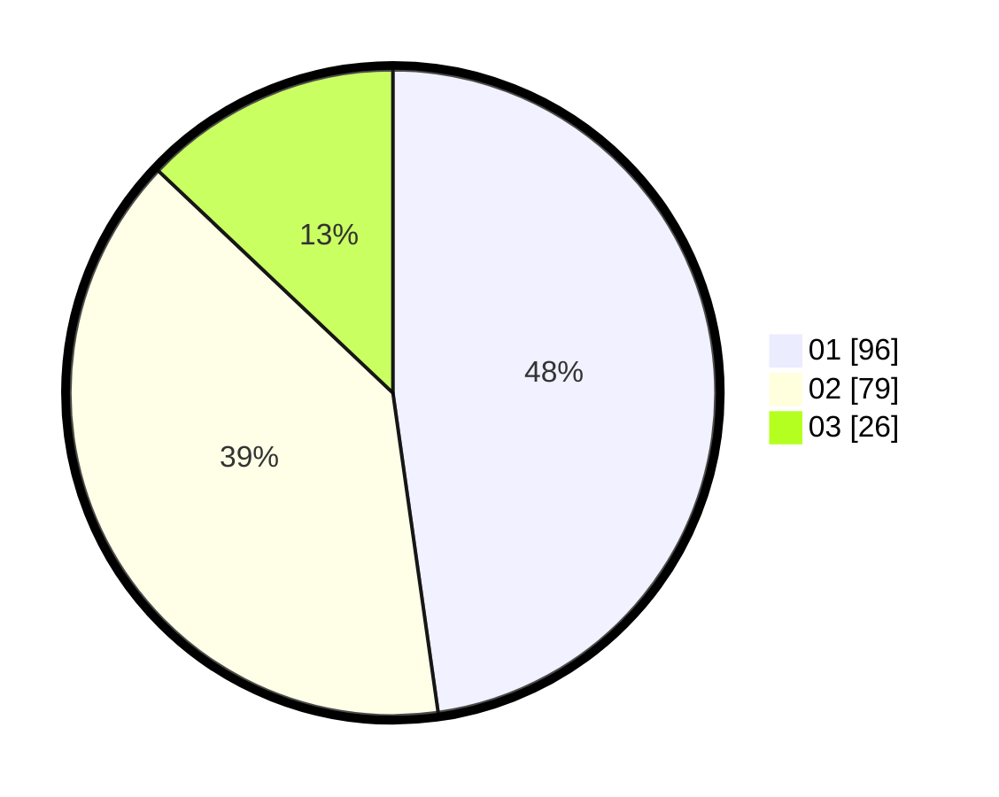

# Hasil

Hasil perolehan suara paslon dapat dilihat pada file paslon-01.txt, paslon-02.txt, dan paslon-03.txt.

Jika tidak ada, artinya data tersebut belum ada pada SIREKAP.

## Perolehan Suara

 * Paslon 01: **96**.
 * Paslon 02: **79**.
 * Paslon 03: **26**.

## Foto C Plano

https://sirekap-obj-formc.kpu.go.id/eaf0/pemilu/ppwp/31/75/09/10/05/3175091005100-20240216-140123--fcc92ffb-fdbf-4626-88f5-85d65e71c911.jpg

https://sirekap-obj-formc.kpu.go.id/eaf0/pemilu/ppwp/31/75/09/10/05/3175091005100-20240216-003715--2bc801ed-0b20-4922-9204-dbb0ac402996.jpg

https://sirekap-obj-formc.kpu.go.id/eaf0/pemilu/ppwp/31/75/09/10/05/3175091005100-20240216-003714--8a1760fd-8e31-4d5f-b09a-ab96b8d59050.jpg

## DATA PEMILIH TETAP

Jumlah pemilih dalam DPT: **262**.
 * L: **133**.
 * P: **129**.

## DATA PENGGUNA HAK PILIH

Jumlah pengguna hak pilih dalam DPT: **201**.
 * L: **97**.
 * P: **104**.

Jumlah pengguna hak pilih dalam DPTb: **1**.
 * L: **1**.
 * P: **0**.

Jumlah pengguna hak pilih dalam DPK: **2**.
 * L: **1**.
 * P: **1**.

Jumlah pengguna hak pilih: **204**.
 * L: **99**.
 * P: **105**.

## JUMLAH SUARA SAH DAN TIDAK SAH

JUMLAH SELURUH SUARA SAH: **201**.

JUMLAH SUARA TIDAK SAH: **3**.

JUMLAH SELURUH SUARA SAH DAN SUARA TIDAK SAH: **204**.
