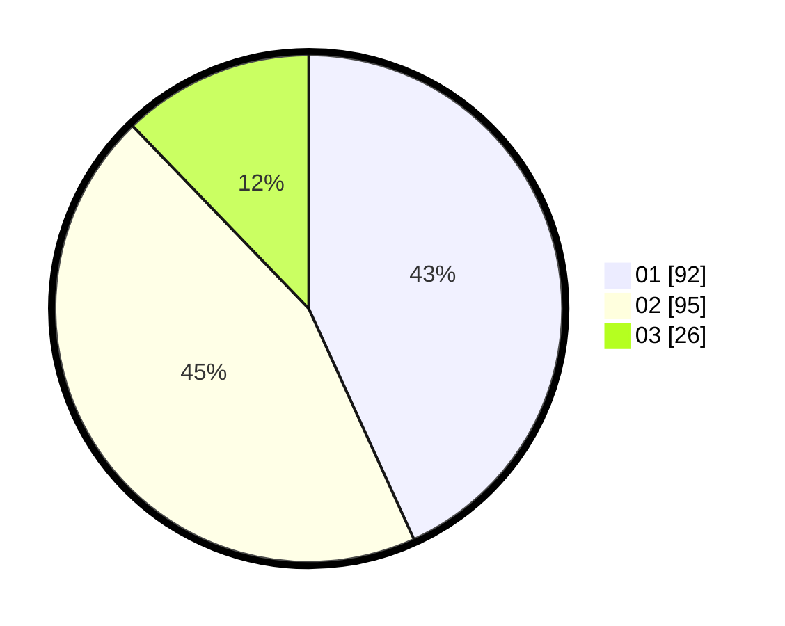

# Hasil

Hasil perolehan suara paslon dapat dilihat pada file paslon-01.txt, paslon-02.txt, dan paslon-03.txt.

Jika tidak ada, artinya data tersebut belum ada pada SIREKAP.

## Perolehan Suara

 * Paslon 01: **92**.
 * Paslon 02: **95**.
 * Paslon 03: **26**.

## Foto C Plano

https://sirekap-obj-formc.kpu.go.id/3ae2/pemilu/ppwp/31/75/09/10/05/3175091005107-20240216-200553--f68d26d2-79d2-4c51-b72c-1664b1730eac.jpg

https://sirekap-obj-formc.kpu.go.id/3ae2/pemilu/ppwp/31/75/09/10/05/3175091005107-20240216-200556--a1fff632-6595-4879-a6b5-aaeb445449b3.jpg

https://sirekap-obj-formc.kpu.go.id/3ae2/pemilu/ppwp/31/75/09/10/05/3175091005107-20240216-200554--0db82884-7a52-4064-bfb8-3f33b82c9af3.jpg

## DATA PEMILIH TETAP

Jumlah pemilih dalam DPT: **280**.
 * L: **134**.
 * P: **146**.

## DATA PENGGUNA HAK PILIH

Jumlah pengguna hak pilih dalam DPT: **213**.
 * L: **93**.
 * P: **120**.

Jumlah pengguna hak pilih dalam DPTb: **0**.
 * L: **0**.
 * P: **0**.

Jumlah pengguna hak pilih dalam DPK: **0**.
 * L: **0**.
 * P: **0**.

Jumlah pengguna hak pilih: **213**.
 * L: **93**.
 * P: **120**.

## JUMLAH SUARA SAH DAN TIDAK SAH

JUMLAH SELURUH SUARA SAH: **213**.

JUMLAH SUARA TIDAK SAH: **0**.

JUMLAH SELURUH SUARA SAH DAN SUARA TIDAK SAH: **213**.
