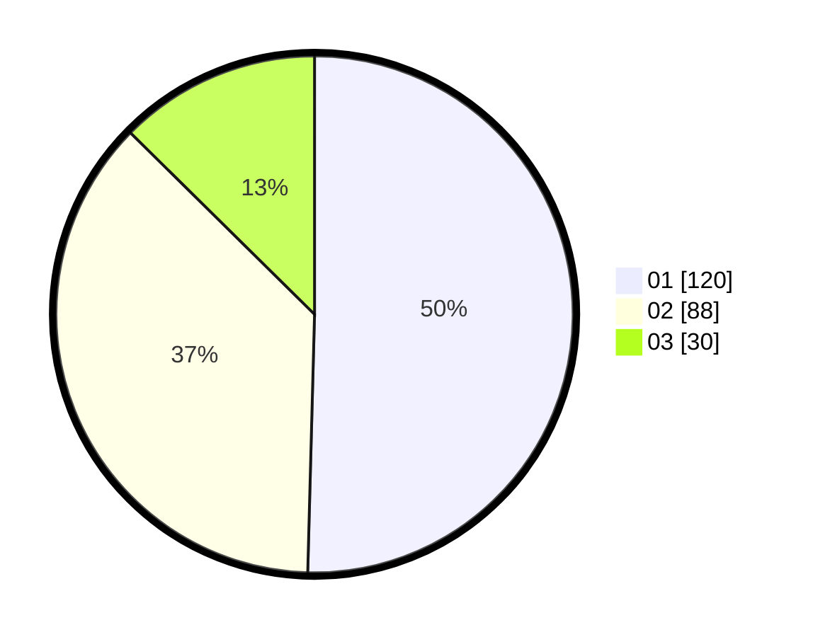

# Hasil

Hasil perolehan suara paslon dapat dilihat pada file paslon-01.txt, paslon-02.txt, dan paslon-03.txt.

Jika tidak ada, artinya data tersebut belum ada pada SIREKAP.

## Perolehan Suara

 * Paslon 01: **120**.
 * Paslon 02: **88**.
 * Paslon 03: **30**.

## Foto C Plano

https://sirekap-obj-formc.kpu.go.id/6bb8/pemilu/ppwp/31/75/09/10/05/3175091005113-20240216-033143--4950be7e-f963-490c-a9e1-d23371b21298.jpg

https://sirekap-obj-formc.kpu.go.id/6bb8/pemilu/ppwp/31/75/09/10/05/3175091005113-20240216-032715--c08c90f6-7983-4dcd-8912-d7ccd8c13e5f.jpg

https://sirekap-obj-formc.kpu.go.id/6bb8/pemilu/ppwp/31/75/09/10/05/3175091005113-20240216-032711--386cd5bd-1b9c-43e9-a830-3abbd6e5c17d.jpg

## DATA PEMILIH TETAP

Jumlah pemilih dalam DPT: **265**.
 * L: **134**.
 * P: **131**.

## DATA PENGGUNA HAK PILIH

Jumlah pengguna hak pilih dalam DPT: **232**.
 * L: **115**.
 * P: **117**.

Jumlah pengguna hak pilih dalam DPTb: **0**.
 * L: **0**.
 * P: **0**.

Jumlah pengguna hak pilih dalam DPK: **6**.
 * L: **2**.
 * P: **4**.

Jumlah pengguna hak pilih: **238**.
 * L: **117**.
 * P: **121**.

## JUMLAH SUARA SAH DAN TIDAK SAH

JUMLAH SELURUH SUARA SAH: **238**.

JUMLAH SUARA TIDAK SAH: **0**.

JUMLAH SELURUH SUARA SAH DAN SUARA TIDAK SAH: **238**.
