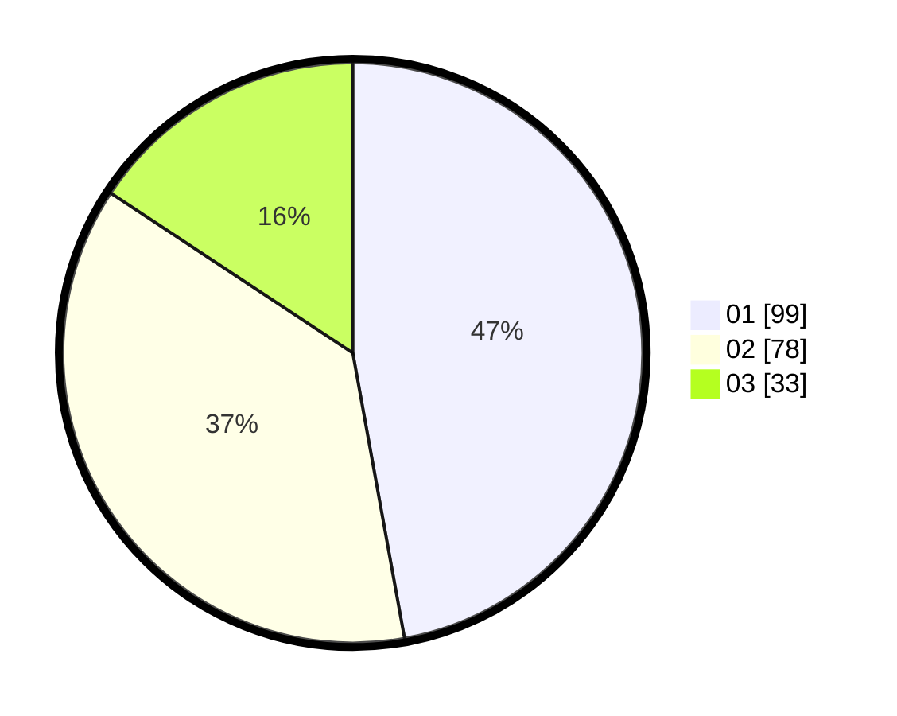

# Hasil

Hasil perolehan suara paslon dapat dilihat pada file paslon-01.txt, paslon-02.txt, dan paslon-03.txt.

Jika tidak ada, artinya data tersebut belum ada pada SIREKAP.

## Perolehan Suara

 * Paslon 01: **99**.
 * Paslon 02: **78**.
 * Paslon 03: **33**.

## Foto C Plano

https://sirekap-obj-formc.kpu.go.id/7824/pemilu/ppwp/31/75/09/10/05/3175091005118-20240217-230032--d257d590-6a2a-4e65-a89e-3fd7be0f957a.jpg

https://sirekap-obj-formc.kpu.go.id/7824/pemilu/ppwp/31/75/09/10/05/3175091005118-20240217-230036--d619d394-cb37-4d46-a56a-342bae16ce68.jpg

https://sirekap-obj-formc.kpu.go.id/7824/pemilu/ppwp/31/75/09/10/05/3175091005118-20240217-230040--16a5953f-1585-4f48-8215-0444cb3f2f27.jpg

## DATA PEMILIH TETAP

Jumlah pemilih dalam DPT: **271**.
 * L: **135**.
 * P: **136**.

## DATA PENGGUNA HAK PILIH

Jumlah pengguna hak pilih dalam DPT: **271**.
 * L: **135**.
 * P: **136**.

Jumlah pengguna hak pilih dalam DPTb: **0**.
 * L: **0**.
 * P: **0**.

Jumlah pengguna hak pilih dalam DPK: **4**.
 * L: **2**.
 * P: **2**.

Jumlah pengguna hak pilih: **214**.
 * L: **103**.
 * P: **111**.

## JUMLAH SUARA SAH DAN TIDAK SAH

JUMLAH SELURUH SUARA SAH: **210**.

JUMLAH SUARA TIDAK SAH: **4**.

JUMLAH SELURUH SUARA SAH DAN SUARA TIDAK SAH: **214**.
