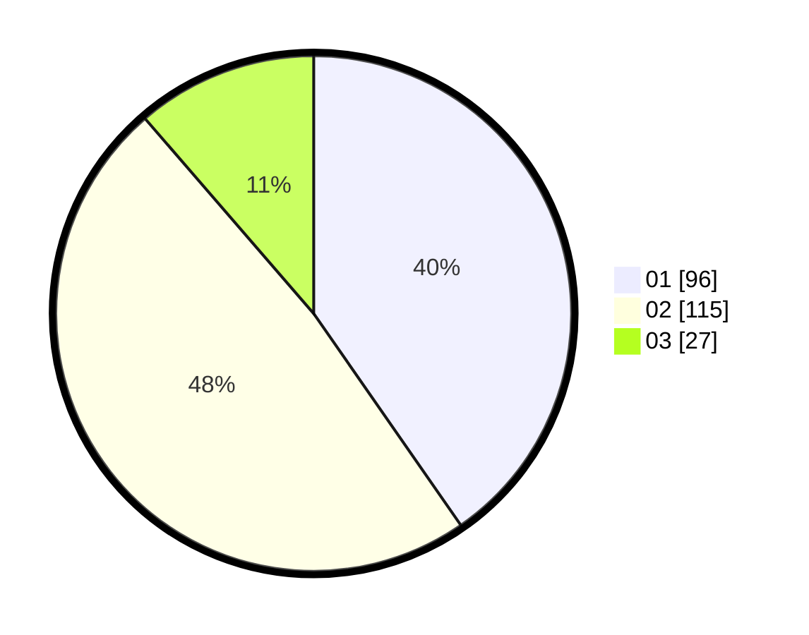

# Hasil

Hasil perolehan suara paslon dapat dilihat pada file paslon-01.txt, paslon-02.txt, dan paslon-03.txt.

Jika tidak ada, artinya data tersebut belum ada pada SIREKAP.

## Perolehan Suara

 * Paslon 01: **96**.
 * Paslon 02: **115**.
 * Paslon 03: **27**.

## Foto C Plano

https://sirekap-obj-formc.kpu.go.id/2c7b/pemilu/ppwp/31/75/10/10/01/3175101001011-20240214-203659--54530993-c5d1-407e-8154-80331492e00d.jpg

https://sirekap-obj-formc.kpu.go.id/2c7b/pemilu/ppwp/31/75/10/10/01/3175101001011-20240214-203750--9d8306da-fd07-41dc-9b9d-4e11211e2fc9.jpg

https://sirekap-obj-formc.kpu.go.id/2c7b/pemilu/ppwp/31/75/10/10/01/3175101001011-20240214-203940--55905194-035f-4168-8f5a-285a55584720.jpg

## DATA PEMILIH TETAP

Jumlah pemilih dalam DPT: **273**.
 * L: **131**.
 * P: **142**.

## DATA PENGGUNA HAK PILIH

Jumlah pengguna hak pilih dalam DPT: **232**.
 * L: **109**.
 * P: **123**.

Jumlah pengguna hak pilih dalam DPTb: **3**.
 * L: **2**.
 * P: **1**.

Jumlah pengguna hak pilih dalam DPK: **3**.
 * L: **3**.
 * P: **0**.

Jumlah pengguna hak pilih: **238**.
 * L: **114**.
 * P: **124**.

## JUMLAH SUARA SAH DAN TIDAK SAH

JUMLAH SELURUH SUARA SAH: **238**.

JUMLAH SUARA TIDAK SAH: **0**.

JUMLAH SELURUH SUARA SAH DAN SUARA TIDAK SAH: **238**.
