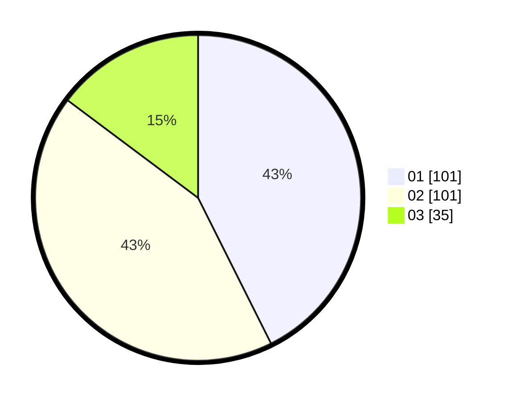

# Hasil

Hasil perolehan suara paslon dapat dilihat pada file paslon-01.txt, paslon-02.txt, dan paslon-03.txt.

Jika tidak ada, artinya data tersebut belum ada pada SIREKAP.

## Perolehan Suara

 * Paslon 01: **101**.
 * Paslon 02: **101**.
 * Paslon 03: **35**.

## Foto C Plano

https://sirekap-obj-formc.kpu.go.id/191b/pemilu/ppwp/31/75/10/10/01/3175101001013-20240214-195704--b1a4a08b-2cc7-45f9-b1eb-1a08bc751bf5.jpg

https://sirekap-obj-formc.kpu.go.id/191b/pemilu/ppwp/31/75/10/10/01/3175101001013-20240214-191153--13de728a-420b-4158-bc27-9a46dfc80016.jpg

https://sirekap-obj-formc.kpu.go.id/191b/pemilu/ppwp/31/75/10/10/01/3175101001013-20240214-191253--802ac8a3-3f33-4c06-bae4-27982fc09107.jpg

## DATA PEMILIH TETAP

Jumlah pemilih dalam DPT: **278**.
 * L: **141**.
 * P: **137**.

## DATA PENGGUNA HAK PILIH

Jumlah pengguna hak pilih dalam DPT: **227**.
 * L: **109**.
 * P: **118**.

Jumlah pengguna hak pilih dalam DPTb: **11**.
 * L: **0**.
 * P: **11**.

Jumlah pengguna hak pilih dalam DPK: **0**.
 * L: **0**.
 * P: **0**.

Jumlah pengguna hak pilih: **238**.
 * L: **109**.
 * P: **129**.

## JUMLAH SUARA SAH DAN TIDAK SAH

JUMLAH SELURUH SUARA SAH: **237**.

JUMLAH SUARA TIDAK SAH: **1**.

JUMLAH SELURUH SUARA SAH DAN SUARA TIDAK SAH: **238**.
