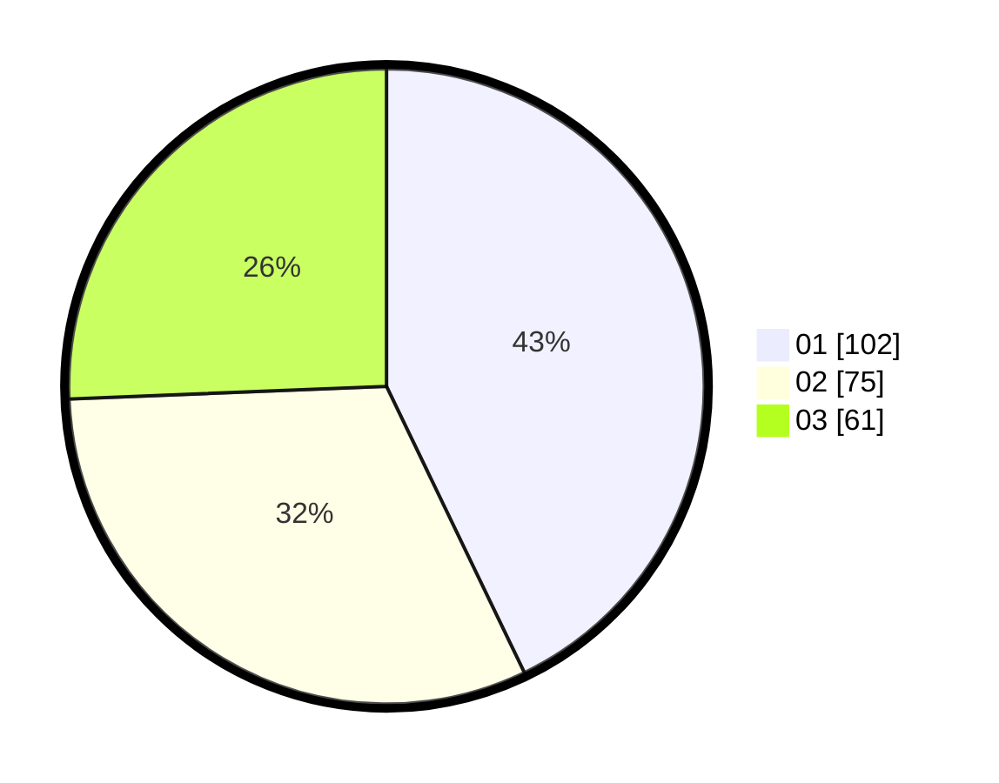

# Hasil

Hasil perolehan suara paslon dapat dilihat pada file paslon-01.txt, paslon-02.txt, dan paslon-03.txt.

Jika tidak ada, artinya data tersebut belum ada pada SIREKAP.

## Perolehan Suara

 * Paslon 01: **102**.
 * Paslon 02: **75**.
 * Paslon 03: **61**.

## Foto C Plano

https://sirekap-obj-formc.kpu.go.id/1a56/pemilu/ppwp/31/75/10/10/01/3175101001020-20240216-144637--2fa68913-cc42-40f2-a93b-67d4fce20293.jpg

https://sirekap-obj-formc.kpu.go.id/1a56/pemilu/ppwp/31/75/10/10/01/3175101001020-20240217-135436--f17c43da-c2d9-4841-a95b-69cee1314192.jpg

https://sirekap-obj-formc.kpu.go.id/1a56/pemilu/ppwp/31/75/10/10/01/3175101001020-20240217-140154--61f0edbc-11e8-49b5-ba02-ad8a30946ec0.jpg

## DATA PEMILIH TETAP

Jumlah pemilih dalam DPT: **268**.
 * L: **125**.
 * P: **143**.

## DATA PENGGUNA HAK PILIH

Jumlah pengguna hak pilih dalam DPT: **231**.
 * L: **104**.
 * P: **127**.

Jumlah pengguna hak pilih dalam DPTb: **9**.
 * L: **4**.
 * P: **5**.

Jumlah pengguna hak pilih dalam DPK: **1**.
 * L: **1**.
 * P: **0**.

Jumlah pengguna hak pilih: **241**.
 * L: **109**.
 * P: **132**.

## JUMLAH SUARA SAH DAN TIDAK SAH

JUMLAH SELURUH SUARA SAH: **238**.

JUMLAH SUARA TIDAK SAH: **3**.

JUMLAH SELURUH SUARA SAH DAN SUARA TIDAK SAH: **241**.
