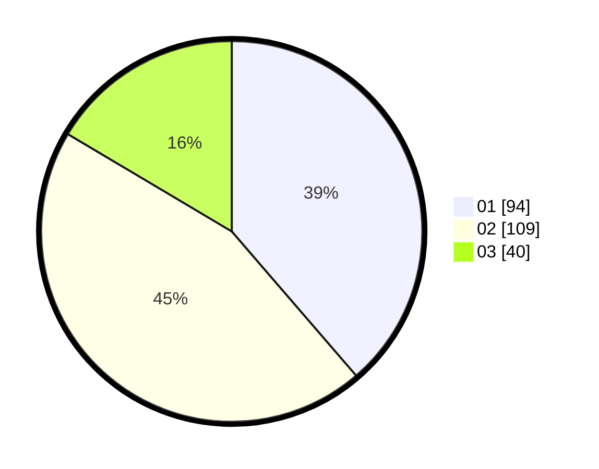

# Hasil

Hasil perolehan suara paslon dapat dilihat pada file paslon-01.txt, paslon-02.txt, dan paslon-03.txt.

Jika tidak ada, artinya data tersebut belum ada pada SIREKAP.

## Perolehan Suara

 * Paslon 01: **94**.
 * Paslon 02: **109**.
 * Paslon 03: **40**.

## Foto C Plano

https://sirekap-obj-formc.kpu.go.id/42a6/pemilu/ppwp/31/75/10/10/01/3175101001024-20240214-185033--37941c17-1264-413b-9e9b-e1e9ef2a4f01.jpg

https://sirekap-obj-formc.kpu.go.id/42a6/pemilu/ppwp/31/75/10/10/01/3175101001024-20240214-185258--8184bf64-acdf-4265-95ea-fc74d82351a1.jpg

https://sirekap-obj-formc.kpu.go.id/42a6/pemilu/ppwp/31/75/10/10/01/3175101001024-20240214-185313--42c5659d-9882-425b-ad39-30678e81f077.jpg

## DATA PEMILIH TETAP

Jumlah pemilih dalam DPT: **272**.
 * L: **130**.
 * P: **142**.

## DATA PENGGUNA HAK PILIH

Jumlah pengguna hak pilih dalam DPT: **240**.
 * L: **108**.
 * P: **132**.

Jumlah pengguna hak pilih dalam DPTb: **2**.
 * L: **0**.
 * P: **2**.

Jumlah pengguna hak pilih dalam DPK: **4**.
 * L: **4**.
 * P: **0**.

Jumlah pengguna hak pilih: **246**.
 * L: **112**.
 * P: **134**.

## JUMLAH SUARA SAH DAN TIDAK SAH

JUMLAH SELURUH SUARA SAH: **243**.

JUMLAH SUARA TIDAK SAH: **3**.

JUMLAH SELURUH SUARA SAH DAN SUARA TIDAK SAH: **246**.
