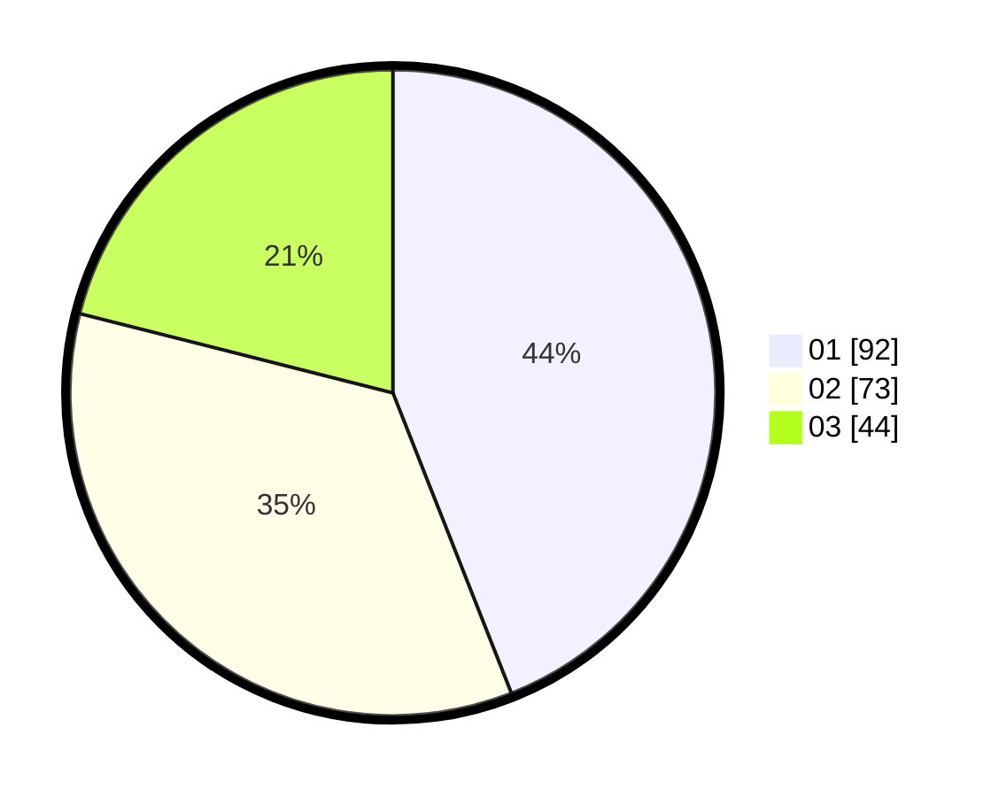

# Hasil

Hasil perolehan suara paslon dapat dilihat pada file paslon-01.txt, paslon-02.txt, dan paslon-03.txt.

Jika tidak ada, artinya data tersebut belum ada pada SIREKAP.

## Perolehan Suara

 * Paslon 01: **92**.
 * Paslon 02: **73**.
 * Paslon 03: **44**.

## Foto C Plano

https://sirekap-obj-formc.kpu.go.id/e75d/pemilu/ppwp/31/75/10/10/01/3175101001034-20240214-155341--4a3b4f57-c74c-4861-b227-6a4ca95f5795.jpg

https://sirekap-obj-formc.kpu.go.id/e75d/pemilu/ppwp/31/75/10/10/01/3175101001034-20240214-155428--0f169549-5369-47b9-ae4e-16ad1e2324b4.jpg

https://sirekap-obj-formc.kpu.go.id/e75d/pemilu/ppwp/31/75/10/10/01/3175101001034-20240214-155509--5d5e21d8-8203-4a4c-b9b5-03adc3506906.jpg

## DATA PEMILIH TETAP

Jumlah pemilih dalam DPT: **276**.
 * L: **141**.
 * P: **135**.

## DATA PENGGUNA HAK PILIH

Jumlah pengguna hak pilih dalam DPT: **216**.
 * L: **107**.
 * P: **109**.

Jumlah pengguna hak pilih dalam DPTb: **0**.
 * L: **0**.
 * P: **0**.

Jumlah pengguna hak pilih dalam DPK: **3**.
 * L: **2**.
 * P: **1**.

Jumlah pengguna hak pilih: **219**.
 * L: **109**.
 * P: **110**.

## JUMLAH SUARA SAH DAN TIDAK SAH

JUMLAH SELURUH SUARA SAH: **209**.

JUMLAH SUARA TIDAK SAH: **10**.

JUMLAH SELURUH SUARA SAH DAN SUARA TIDAK SAH: **219**.
