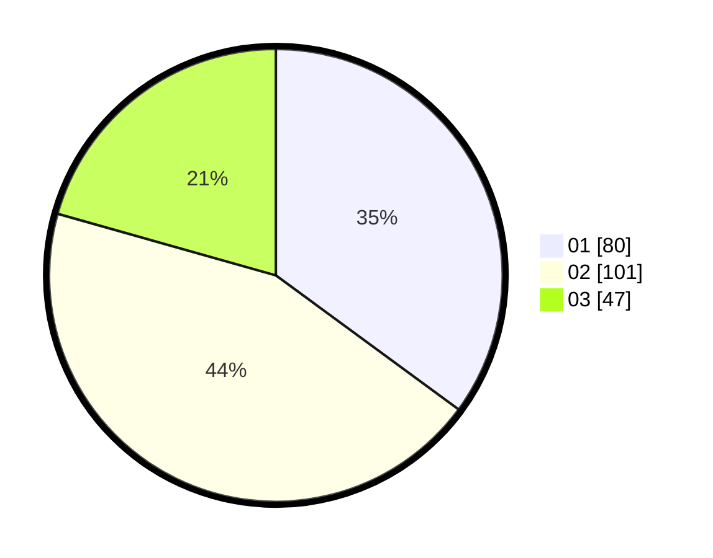

# Hasil

Hasil perolehan suara paslon dapat dilihat pada file paslon-01.txt, paslon-02.txt, dan paslon-03.txt.

Jika tidak ada, artinya data tersebut belum ada pada SIREKAP.

## Perolehan Suara

 * Paslon 01: **80**.
 * Paslon 02: **101**.
 * Paslon 03: **47**.

## Foto C Plano

https://sirekap-obj-formc.kpu.go.id/3e4a/pemilu/ppwp/31/75/10/10/01/3175101001039-20240216-014426--892ebfe3-6251-4451-90c3-03557445c5bc.jpg

https://sirekap-obj-formc.kpu.go.id/3e4a/pemilu/ppwp/31/75/10/10/01/3175101001039-20240216-014428--ecc266fd-d236-43f9-bd88-9a31a5abff7b.jpg

https://sirekap-obj-formc.kpu.go.id/3e4a/pemilu/ppwp/31/75/10/10/01/3175101001039-20240216-014427--d2656c88-2182-4004-89ef-05996dba53e3.jpg

## DATA PEMILIH TETAP

Jumlah pemilih dalam DPT: **268**.
 * L: **125**.
 * P: **143**.

## DATA PENGGUNA HAK PILIH

Jumlah pengguna hak pilih dalam DPT: **225**.
 * L: **106**.
 * P: **119**.

Jumlah pengguna hak pilih dalam DPTb: **0**.
 * L: **0**.
 * P: **0**.

Jumlah pengguna hak pilih dalam DPK: **4**.
 * L: **3**.
 * P: **1**.

Jumlah pengguna hak pilih: **229**.
 * L: **109**.
 * P: **120**.

## JUMLAH SUARA SAH DAN TIDAK SAH

JUMLAH SELURUH SUARA SAH: **228**.

JUMLAH SUARA TIDAK SAH: **1**.

JUMLAH SELURUH SUARA SAH DAN SUARA TIDAK SAH: **229**.
