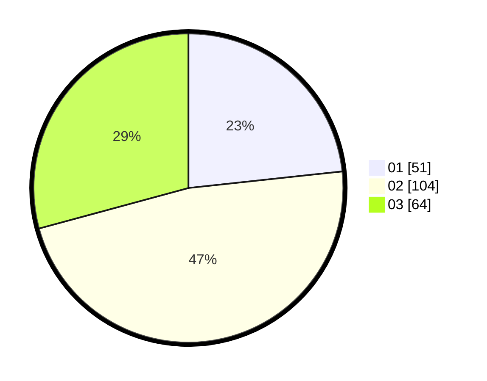

# Hasil

Hasil perolehan suara paslon dapat dilihat pada file paslon-01.txt, paslon-02.txt, dan paslon-03.txt.

Jika tidak ada, artinya data tersebut belum ada pada SIREKAP.

## Perolehan Suara

 * Paslon 01: **51**.
 * Paslon 02: **104**.
 * Paslon 03: **64**.

## Foto C Plano

https://sirekap-obj-formc.kpu.go.id/6e9f/pemilu/ppwp/31/75/10/10/01/3175101001040-20240214-191205--826a742b-a996-4ad5-bbdf-4fd31b59c0e0.jpg

https://sirekap-obj-formc.kpu.go.id/6e9f/pemilu/ppwp/31/75/10/10/01/3175101001040-20240214-191228--f25d6fb9-61ef-42a9-a416-f18a61e672bd.jpg

https://sirekap-obj-formc.kpu.go.id/6e9f/pemilu/ppwp/31/75/10/10/01/3175101001040-20240214-191243--71f2e5ea-c505-4243-ac05-e2c5f658a99b.jpg

## DATA PEMILIH TETAP

Jumlah pemilih dalam DPT: **266**.
 * L: **127**.
 * P: **139**.

## DATA PENGGUNA HAK PILIH

Jumlah pengguna hak pilih dalam DPT: **214**.
 * L: **99**.
 * P: **115**.

Jumlah pengguna hak pilih dalam DPTb: **0**.
 * L: **0**.
 * P: **0**.

Jumlah pengguna hak pilih dalam DPK: **6**.
 * L: **1**.
 * P: **5**.

Jumlah pengguna hak pilih: **220**.
 * L: **100**.
 * P: **120**.

## JUMLAH SUARA SAH DAN TIDAK SAH

JUMLAH SELURUH SUARA SAH: **219**.

JUMLAH SUARA TIDAK SAH: **1**.

JUMLAH SELURUH SUARA SAH DAN SUARA TIDAK SAH: **220**.
