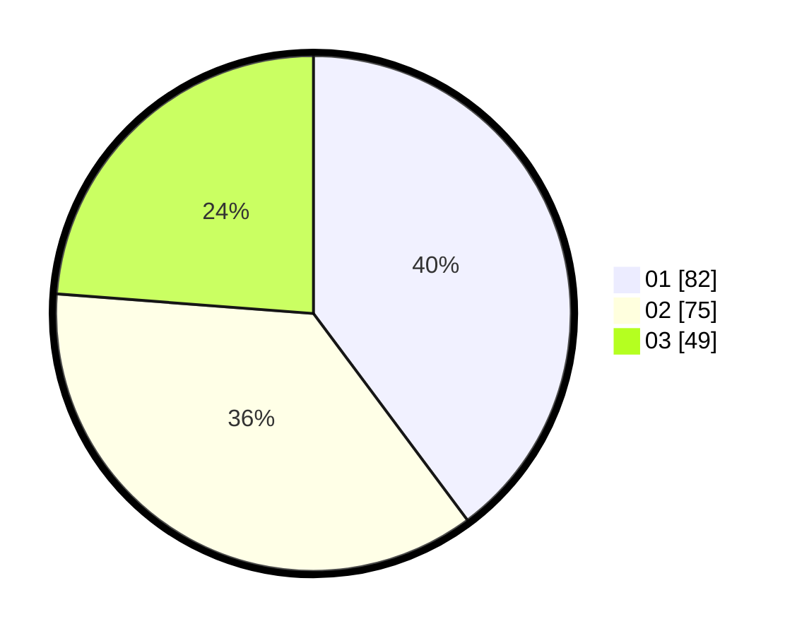

# Hasil

Hasil perolehan suara paslon dapat dilihat pada file paslon-01.txt, paslon-02.txt, dan paslon-03.txt.

Jika tidak ada, artinya data tersebut belum ada pada SIREKAP.

## Perolehan Suara

 * Paslon 01: **82**.
 * Paslon 02: **75**.
 * Paslon 03: **49**.

## Foto C Plano

https://sirekap-obj-formc.kpu.go.id/eb05/pemilu/ppwp/31/75/10/10/01/3175101001041-20240214-155411--e2e4fa37-793f-4651-b678-634b60dfbe79.jpg

https://sirekap-obj-formc.kpu.go.id/eb05/pemilu/ppwp/31/75/10/10/01/3175101001041-20240214-155441--e723c6e5-cf6a-4255-a7fe-37496aa04302.jpg

https://sirekap-obj-formc.kpu.go.id/eb05/pemilu/ppwp/31/75/10/10/01/3175101001041-20240214-155535--9157e88f-2b0e-4c8e-9c63-cf4e64cf65cd.jpg

## DATA PEMILIH TETAP

Jumlah pemilih dalam DPT: **257**.
 * L: **127**.
 * P: **130**.

## DATA PENGGUNA HAK PILIH

Jumlah pengguna hak pilih dalam DPT: **206**.
 * L: **108**.
 * P: **98**.

Jumlah pengguna hak pilih dalam DPTb: **0**.
 * L: **0**.
 * P: **0**.

Jumlah pengguna hak pilih dalam DPK: **0**.
 * L: **0**.
 * P: **0**.

Jumlah pengguna hak pilih: **206**.
 * L: **108**.
 * P: **98**.

## JUMLAH SUARA SAH DAN TIDAK SAH

JUMLAH SELURUH SUARA SAH: **206**.

JUMLAH SUARA TIDAK SAH: **0**.

JUMLAH SELURUH SUARA SAH DAN SUARA TIDAK SAH: **206**.
