# Hasil

Hasil perolehan suara paslon dapat dilihat pada file paslon-01.txt, paslon-02.txt, dan paslon-03.txt.

Jika tidak ada, artinya data tersebut belum ada pada SIREKAP.

## Perolehan Suara

 * Paslon 01: **81**.
 * Paslon 02: **86**.
 * Paslon 03: **36**.

```mermaid
%%{init: {"pie": {"textPosition": 0.5}, "themeVariables": {"pieOuterStrokeWidth": "5px"}} }%%
pie showData
    "01" : 81
    "02" : 86
    "03" : 36
```

## Foto C Plano

https://sirekap-obj-formc.kpu.go.id/9d85/pemilu/ppwp/31/75/10/10/01/3175101001042-20240214-155848--399a7814-0497-49e4-a12e-49393ff0b844.jpg

https://sirekap-obj-formc.kpu.go.id/9d85/pemilu/ppwp/31/75/10/10/01/3175101001042-20240214-160059--04f372a3-cb09-447d-83ac-b4e0cfa04b91.jpg

https://sirekap-obj-formc.kpu.go.id/9d85/pemilu/ppwp/31/75/10/10/01/3175101001042-20240214-155201--80c52a83-494b-4914-bfcc-a1d7ed4576bb.jpg
