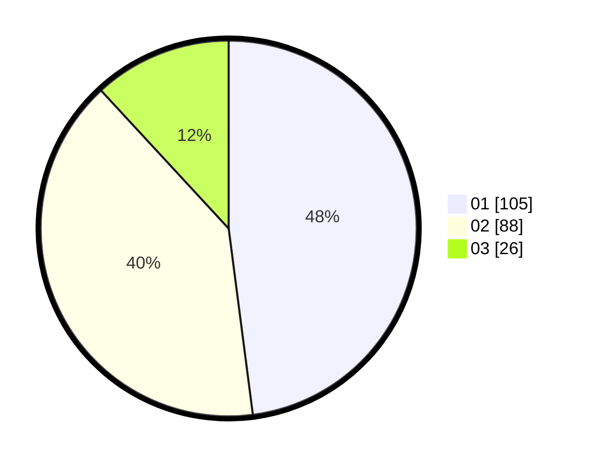

# Hasil

Hasil perolehan suara paslon dapat dilihat pada file paslon-01.txt, paslon-02.txt, dan paslon-03.txt.

Jika tidak ada, artinya data tersebut belum ada pada SIREKAP.

## Perolehan Suara

 * Paslon 01: **105**.
 * Paslon 02: **88**.
 * Paslon 03: **26**.

## Foto C Plano

https://sirekap-obj-formc.kpu.go.id/77f5/pemilu/ppwp/31/75/10/10/01/3175101001048-20240214-194910--0eb04ac1-3675-44e1-bb08-c224de6ccaf9.jpg

https://sirekap-obj-formc.kpu.go.id/77f5/pemilu/ppwp/31/75/10/10/01/3175101001048-20240214-194925--1ccd2e9f-5434-4b62-9bd9-979ebb8f626c.jpg

https://sirekap-obj-formc.kpu.go.id/77f5/pemilu/ppwp/31/75/10/10/01/3175101001048-20240214-194938--b8d39d00-34f2-4f94-ba4e-e0be65eef107.jpg
