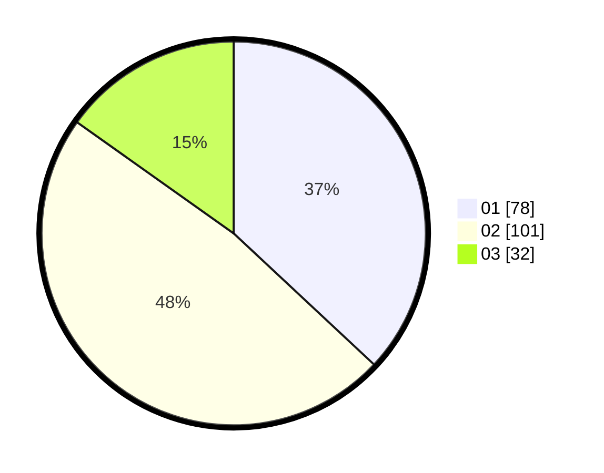

# Hasil

Hasil perolehan suara paslon dapat dilihat pada file paslon-01.txt, paslon-02.txt, dan paslon-03.txt.

Jika tidak ada, artinya data tersebut belum ada pada SIREKAP.

## Perolehan Suara

 * Paslon 01: **78**.
 * Paslon 02: **101**.
 * Paslon 03: **32**.

## Foto C Plano

https://sirekap-obj-formc.kpu.go.id/4084/pemilu/ppwp/31/75/10/10/01/3175101001049-20240214-190503--c21682be-c9f9-4460-835f-4c6a17101963.jpg

https://sirekap-obj-formc.kpu.go.id/4084/pemilu/ppwp/31/75/10/10/01/3175101001049-20240214-190753--ad4e16d8-7522-429e-9aee-84228837c698.jpg

https://sirekap-obj-formc.kpu.go.id/4084/pemilu/ppwp/31/75/10/10/01/3175101001049-20240214-192302--cd57575b-6c9d-4b50-9d0b-40e4bf231ce6.jpg

## DATA PEMILIH TETAP

Jumlah pemilih dalam DPT: **267**.
 * L: **122**.
 * P: **145**.

## DATA PENGGUNA HAK PILIH

Jumlah pengguna hak pilih dalam DPT: **208**.
 * L: **88**.
 * P: **120**.

Jumlah pengguna hak pilih dalam DPTb: **1**.
 * L: **0**.
 * P: **1**.

Jumlah pengguna hak pilih dalam DPK: **4**.
 * L: **2**.
 * P: **2**.

Jumlah pengguna hak pilih: **213**.
 * L: **90**.
 * P: **123**.

## JUMLAH SUARA SAH DAN TIDAK SAH

JUMLAH SELURUH SUARA SAH: **211**.

JUMLAH SUARA TIDAK SAH: **2**.

JUMLAH SELURUH SUARA SAH DAN SUARA TIDAK SAH: **213**.
