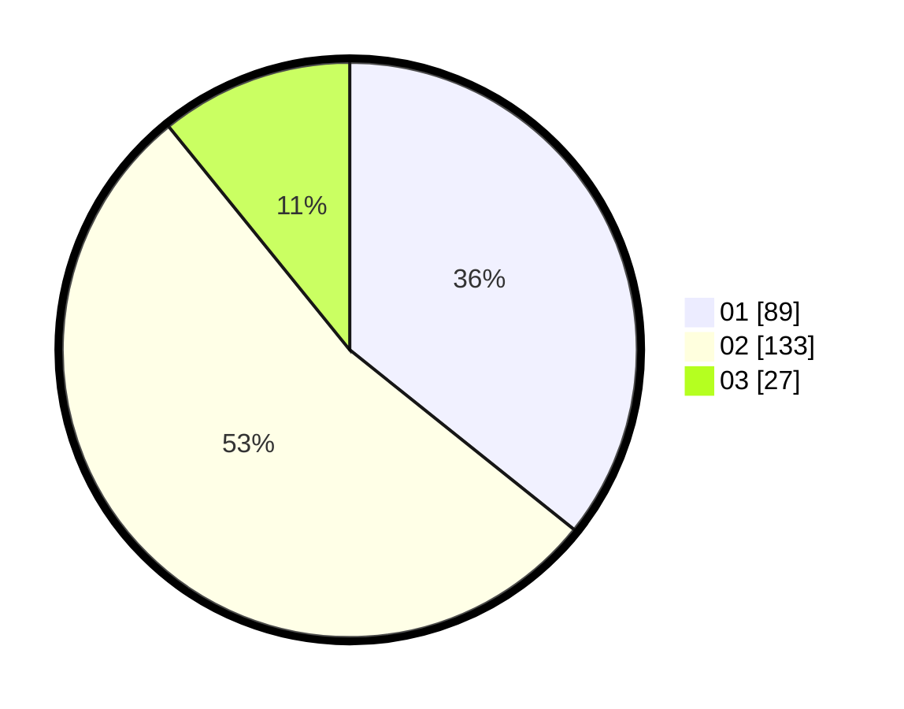

# Hasil

Hasil perolehan suara paslon dapat dilihat pada file paslon-01.txt, paslon-02.txt, dan paslon-03.txt.

Jika tidak ada, artinya data tersebut belum ada pada SIREKAP.

## Perolehan Suara

 * Paslon 01: **89**.
 * Paslon 02: **133**.
 * Paslon 03: **27**.

## Foto C Plano

https://sirekap-obj-formc.kpu.go.id/c2c6/pemilu/ppwp/31/75/10/10/01/3175101001052-20240214-223418--6068a791-2edb-4355-8e50-f7917920d1b1.jpg

https://sirekap-obj-formc.kpu.go.id/c2c6/pemilu/ppwp/31/75/10/10/01/3175101001052-20240214-223320--12790e68-a1d5-4fc5-a111-ae31263ec2dc.jpg

https://sirekap-obj-formc.kpu.go.id/c2c6/pemilu/ppwp/31/75/10/10/01/3175101001052-20240214-223753--cf51b6a0-ddfd-469a-932a-cd051675f6fd.jpg
