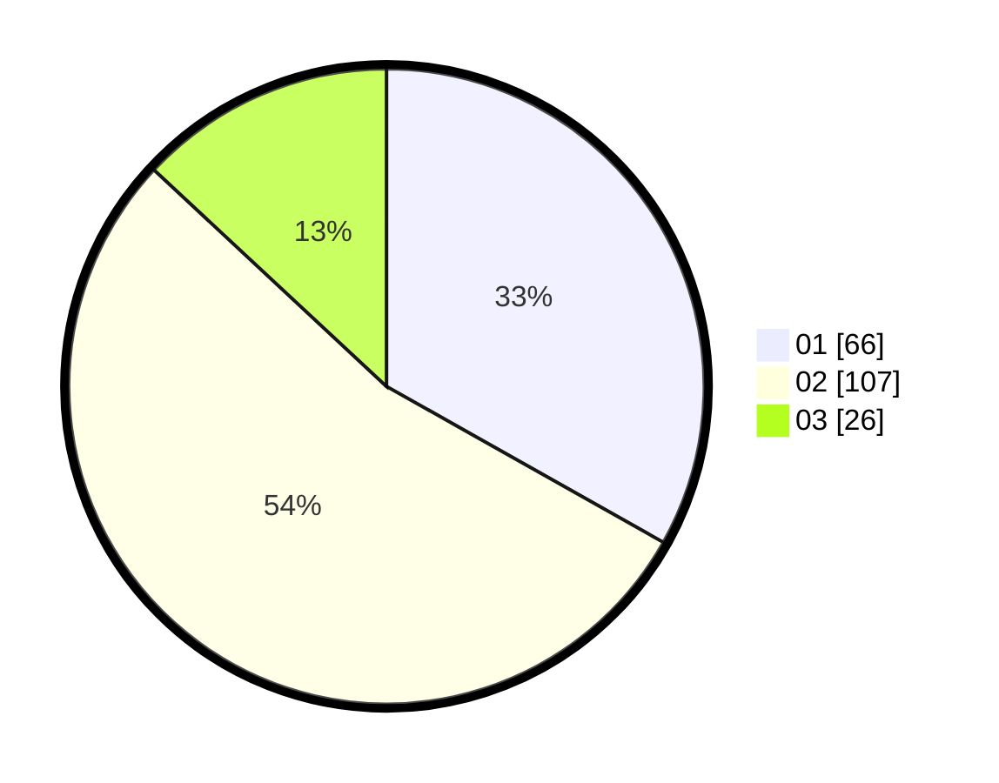

# Hasil

Hasil perolehan suara paslon dapat dilihat pada file paslon-01.txt, paslon-02.txt, dan paslon-03.txt.

Jika tidak ada, artinya data tersebut belum ada pada SIREKAP.

## Perolehan Suara

 * Paslon 01: **66**.
 * Paslon 02: **107**.
 * Paslon 03: **26**.

## Foto C Plano

https://sirekap-obj-formc.kpu.go.id/e2fd/pemilu/ppwp/31/75/10/10/01/3175101001055-20240214-185853--7c159650-1403-40c1-bd94-7389c439505a.jpg

https://sirekap-obj-formc.kpu.go.id/e2fd/pemilu/ppwp/31/75/10/10/01/3175101001055-20240214-185903--42b61267-9be0-4aed-8255-6ff9578467db.jpg

https://sirekap-obj-formc.kpu.go.id/e2fd/pemilu/ppwp/31/75/10/10/01/3175101001055-20240214-185910--c9083f47-55a0-4725-83eb-7994c26c9fb7.jpg

## DATA PEMILIH TETAP

Jumlah pemilih dalam DPT: **275**.
 * L: **129**.
 * P: **146**.

## DATA PENGGUNA HAK PILIH

Jumlah pengguna hak pilih dalam DPT: **199**.
 * L: **92**.
 * P: **107**.

Jumlah pengguna hak pilih dalam DPTb: **2**.
 * L: **0**.
 * P: **2**.

Jumlah pengguna hak pilih dalam DPK: **5**.
 * L: **2**.
 * P: **3**.

Jumlah pengguna hak pilih: **206**.
 * L: **94**.
 * P: **112**.

## JUMLAH SUARA SAH DAN TIDAK SAH

JUMLAH SELURUH SUARA SAH: **199**.

JUMLAH SUARA TIDAK SAH: **7**.

JUMLAH SELURUH SUARA SAH DAN SUARA TIDAK SAH: **206**.
