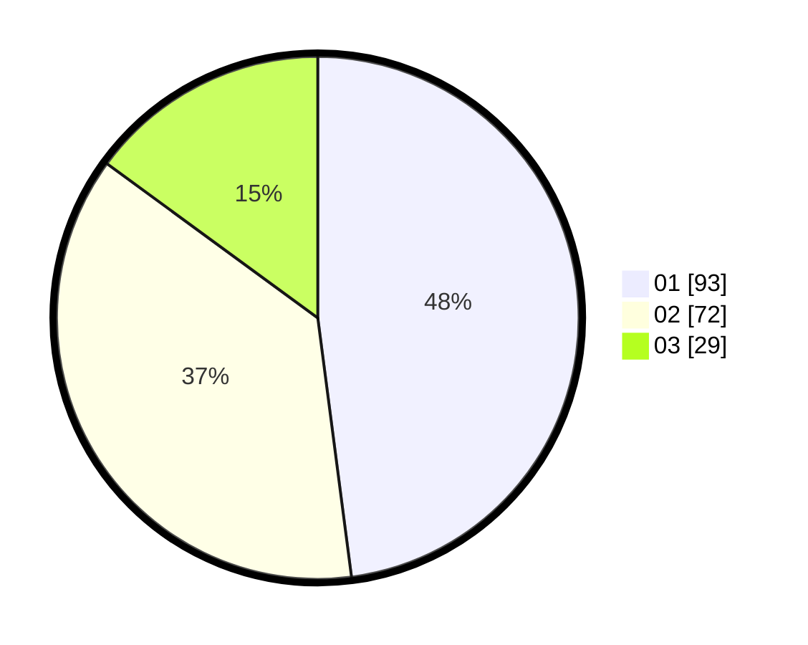

# Hasil

Hasil perolehan suara paslon dapat dilihat pada file paslon-01.txt, paslon-02.txt, dan paslon-03.txt.

Jika tidak ada, artinya data tersebut belum ada pada SIREKAP.

## Perolehan Suara

 * Paslon 01: **93**.
 * Paslon 02: **72**.
 * Paslon 03: **29**.

## Foto C Plano

https://sirekap-obj-formc.kpu.go.id/0b92/pemilu/ppwp/31/75/10/10/01/3175101001068-20240214-235206--3761d88d-6a3e-4ebd-a5dd-db711bc15fd5.jpg

https://sirekap-obj-formc.kpu.go.id/0b92/pemilu/ppwp/31/75/10/10/01/3175101001068-20240214-211435--cbe5ef04-6116-48a5-a3f5-369af32f21aa.jpg

https://sirekap-obj-formc.kpu.go.id/0b92/pemilu/ppwp/31/75/10/10/01/3175101001068-20240214-211450--f79472aa-af4f-4ecc-af69-afa03c745a6b.jpg
