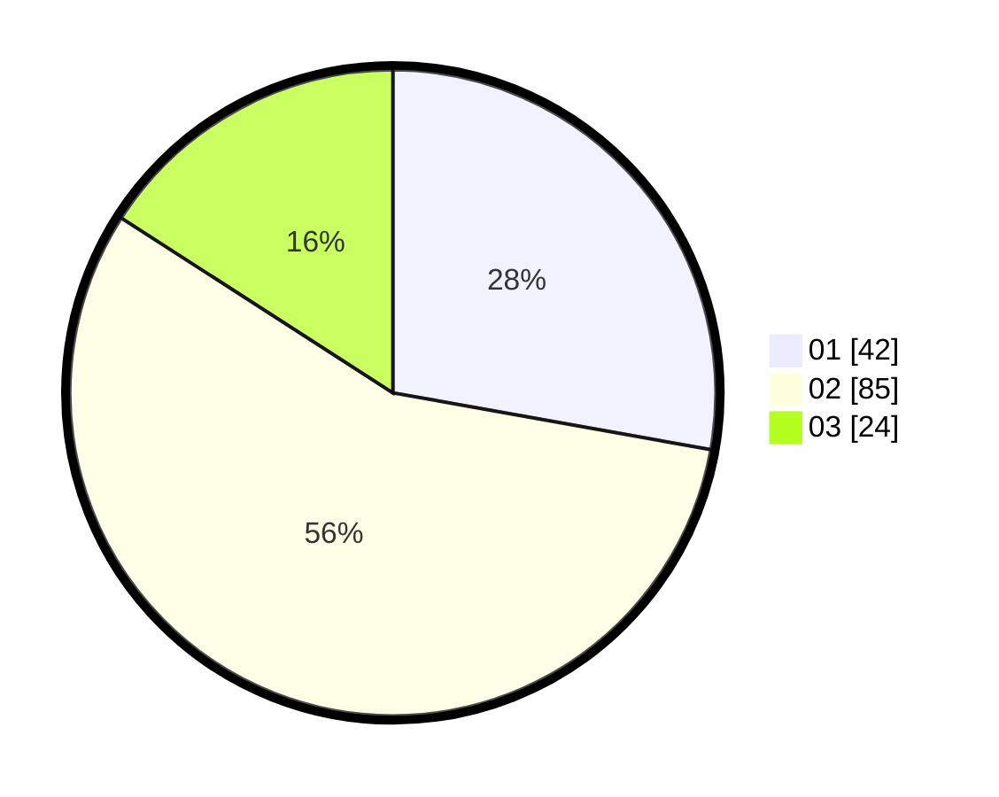

# Hasil

Hasil perolehan suara paslon dapat dilihat pada file paslon-01.txt, paslon-02.txt, dan paslon-03.txt.

Jika tidak ada, artinya data tersebut belum ada pada SIREKAP.

## Perolehan Suara

 * Paslon 01: **42**.
 * Paslon 02: **85**.
 * Paslon 03: **24**.

## Foto C Plano

https://sirekap-obj-formc.kpu.go.id/4eac/pemilu/ppwp/31/75/10/10/01/3175101001072-20240214-221646--ff44c287-c383-4341-83d1-8e29eecdbc27.jpg

https://sirekap-obj-formc.kpu.go.id/4eac/pemilu/ppwp/31/75/10/10/01/3175101001072-20240214-221808--281d90c9-f940-490b-82e3-ccd8a36e6ceb.jpg

https://sirekap-obj-formc.kpu.go.id/4eac/pemilu/ppwp/31/75/10/10/01/3175101001072-20240214-221900--e7d13442-393b-4910-a3ce-68837a0b6071.jpg

## DATA PEMILIH TETAP

Jumlah pemilih dalam DPT: **280**.
 * L: **280**.
 * P: **0**.

## DATA PENGGUNA HAK PILIH

Jumlah pengguna hak pilih dalam DPT: **170**.
 * L: **170**.
 * P: **0**.

Jumlah pengguna hak pilih dalam DPTb: **4**.
 * L: **4**.
 * P: **0**.

Jumlah pengguna hak pilih dalam DPK: **0**.
 * L: **0**.
 * P: **0**.

Jumlah pengguna hak pilih: **174**.
 * L: **174**.
 * P: **0**.

## JUMLAH SUARA SAH DAN TIDAK SAH

JUMLAH SELURUH SUARA SAH: **151**.

JUMLAH SUARA TIDAK SAH: **23**.

JUMLAH SELURUH SUARA SAH DAN SUARA TIDAK SAH: **174**.
