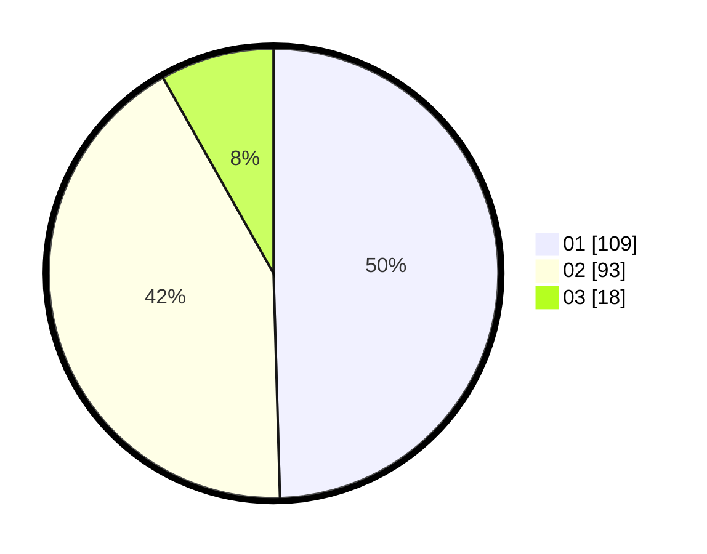

# Hasil

Hasil perolehan suara paslon dapat dilihat pada file paslon-01.txt, paslon-02.txt, dan paslon-03.txt.

Jika tidak ada, artinya data tersebut belum ada pada SIREKAP.

## Perolehan Suara

 * Paslon 01: **109**.
 * Paslon 02: **93**.
 * Paslon 03: **18**.

## Foto C Plano

https://sirekap-obj-formc.kpu.go.id/4103/pemilu/ppwp/31/75/10/10/01/3175101001076-20240214-192434--355c4c51-ddff-4495-a91f-ecde2f00cc50.jpg

https://sirekap-obj-formc.kpu.go.id/4103/pemilu/ppwp/31/75/10/10/01/3175101001076-20240214-192710--1a7bcd7a-e8ae-4ecc-93d5-bda1da5b1d2d.jpg

https://sirekap-obj-formc.kpu.go.id/4103/pemilu/ppwp/31/75/10/10/01/3175101001076-20240214-192811--94f98aac-043b-4024-909d-189a5b1e6466.jpg

## DATA PEMILIH TETAP

Jumlah pemilih dalam DPT: **255**.
 * L: **124**.
 * P: **131**.

## DATA PENGGUNA HAK PILIH

Jumlah pengguna hak pilih dalam DPT: **203**.
 * L: **100**.
 * P: **103**.

Jumlah pengguna hak pilih dalam DPTb: **16**.
 * L: **1**.
 * P: **15**.

Jumlah pengguna hak pilih dalam DPK: **3**.
 * L: **0**.
 * P: **3**.

Jumlah pengguna hak pilih: **222**.
 * L: **101**.
 * P: **121**.

## JUMLAH SUARA SAH DAN TIDAK SAH

JUMLAH SELURUH SUARA SAH: **220**.

JUMLAH SUARA TIDAK SAH: **2**.

JUMLAH SELURUH SUARA SAH DAN SUARA TIDAK SAH: **222**.
