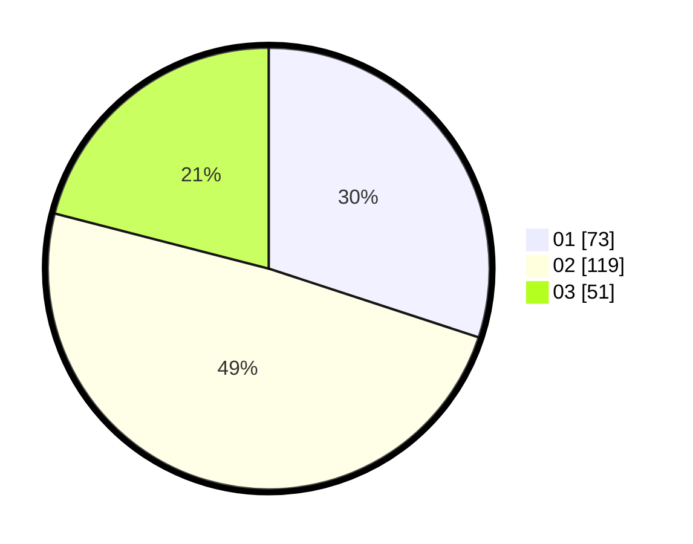

# Hasil

Hasil perolehan suara paslon dapat dilihat pada file paslon-01.txt, paslon-02.txt, dan paslon-03.txt.

Jika tidak ada, artinya data tersebut belum ada pada SIREKAP.

## Perolehan Suara

 * Paslon 01: **73**.
 * Paslon 02: **119**.
 * Paslon 03: **51**.

## Foto C Plano

https://sirekap-obj-formc.kpu.go.id/79c7/pemilu/ppwp/31/75/10/10/01/3175101001079-20240214-220852--90bd0181-5b66-4538-ae2e-ffb3f8fe8eeb.jpg

https://sirekap-obj-formc.kpu.go.id/79c7/pemilu/ppwp/31/75/10/10/01/3175101001079-20240214-221038--59bcbdb0-431f-494d-ae03-5ed63f73ddd7.jpg

https://sirekap-obj-formc.kpu.go.id/79c7/pemilu/ppwp/31/75/10/10/01/3175101001079-20240214-220617--981cd3a6-a97a-4724-966d-a009ba3c0e73.jpg
