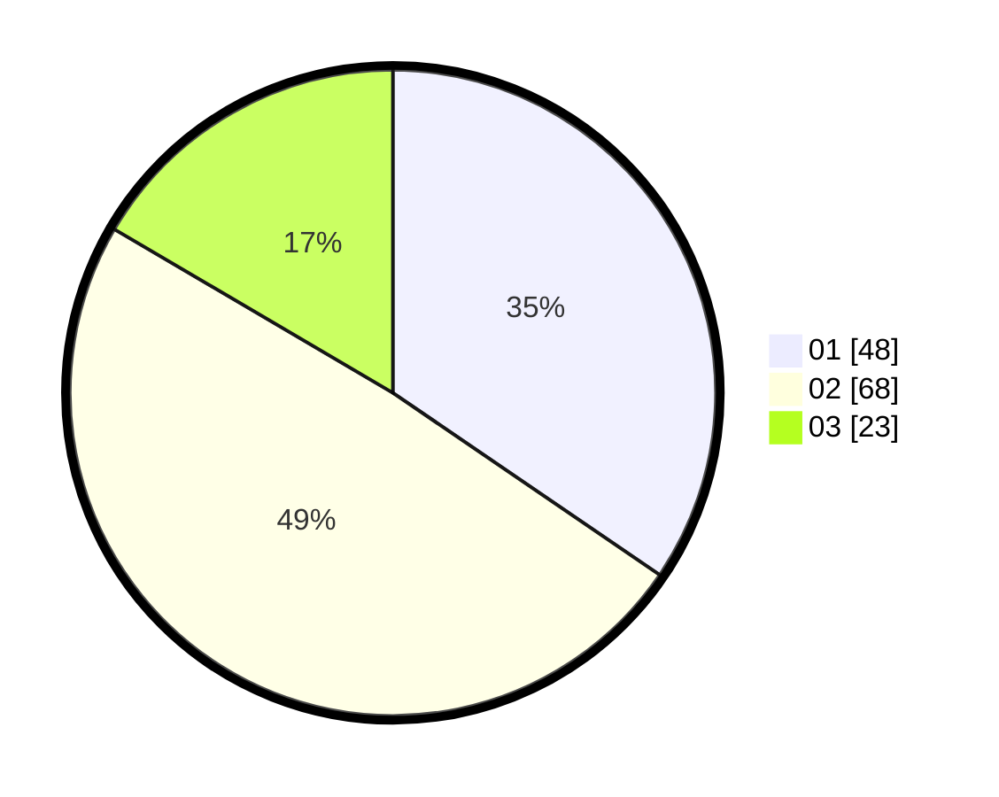

# Hasil

Hasil perolehan suara paslon dapat dilihat pada file paslon-01.txt, paslon-02.txt, dan paslon-03.txt.

Jika tidak ada, artinya data tersebut belum ada pada SIREKAP.

## Perolehan Suara

 * Paslon 01: **48**.
 * Paslon 02: **68**.
 * Paslon 03: **23**.

## Foto C Plano

https://sirekap-obj-formc.kpu.go.id/e2b8/pemilu/ppwp/31/75/10/10/01/3175101001090-20240214-223303--9de939cf-cf23-4926-82b8-ebdedc660b70.jpg

https://sirekap-obj-formc.kpu.go.id/e2b8/pemilu/ppwp/31/75/10/10/01/3175101001090-20240214-202348--79e862ad-bfb1-4d87-aa94-e35fca226606.jpg

https://sirekap-obj-formc.kpu.go.id/e2b8/pemilu/ppwp/31/75/10/10/01/3175101001090-20240214-202437--6b8d86e9-0727-4ab8-a358-6c5a8a6fa5d4.jpg
