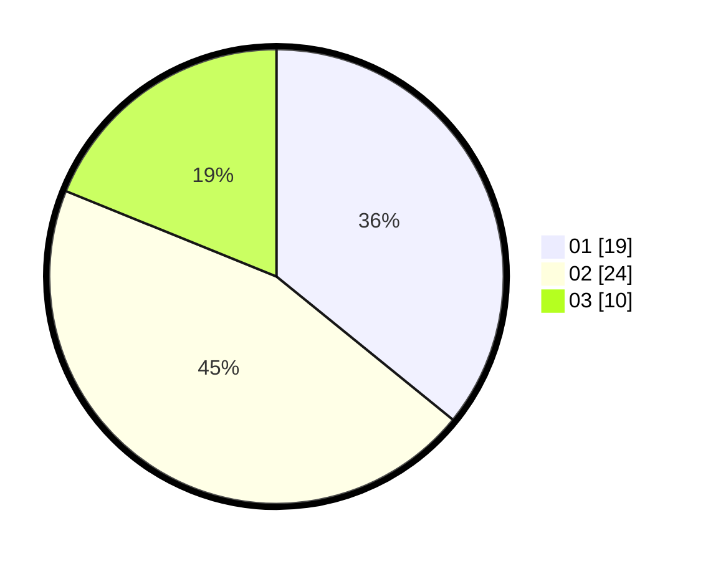

# Hasil

Hasil perolehan suara paslon dapat dilihat pada file paslon-01.txt, paslon-02.txt, dan paslon-03.txt.

Jika tidak ada, artinya data tersebut belum ada pada SIREKAP.

## Perolehan Suara

 * Paslon 01: **19**.
 * Paslon 02: **24**.
 * Paslon 03: **10**.

## Foto C Plano

https://sirekap-obj-formc.kpu.go.id/a642/pemilu/ppwp/31/75/10/10/01/3175101001091-20240214-195616--bcacf185-24e8-4e4c-8975-419b69e6f92c.jpg

https://sirekap-obj-formc.kpu.go.id/a642/pemilu/ppwp/31/75/10/10/01/3175101001091-20240215-110104--75cef2f7-d92a-44e3-b95c-b4380d742ef2.jpg

https://sirekap-obj-formc.kpu.go.id/a642/pemilu/ppwp/31/75/10/10/01/3175101001091-20240214-220024--5917b438-4d59-41a6-8306-9fd61d52f2af.jpg

## DATA PEMILIH TETAP

Jumlah pemilih dalam DPT: **75**.
 * L: **4**.
 * P: **71**.

## DATA PENGGUNA HAK PILIH

Jumlah pengguna hak pilih dalam DPT: **69**.
 * L: **0**.
 * P: **69**.

Jumlah pengguna hak pilih dalam DPTb: **6**.
 * L: **4**.
 * P: **2**.

Jumlah pengguna hak pilih dalam DPK: **0**.
 * L: **0**.
 * P: **0**.

Jumlah pengguna hak pilih: **75**.
 * L: **4**.
 * P: **71**.

## JUMLAH SUARA SAH DAN TIDAK SAH

JUMLAH SELURUH SUARA SAH: **53**.

JUMLAH SUARA TIDAK SAH: **22**.

JUMLAH SELURUH SUARA SAH DAN SUARA TIDAK SAH: **75**.
