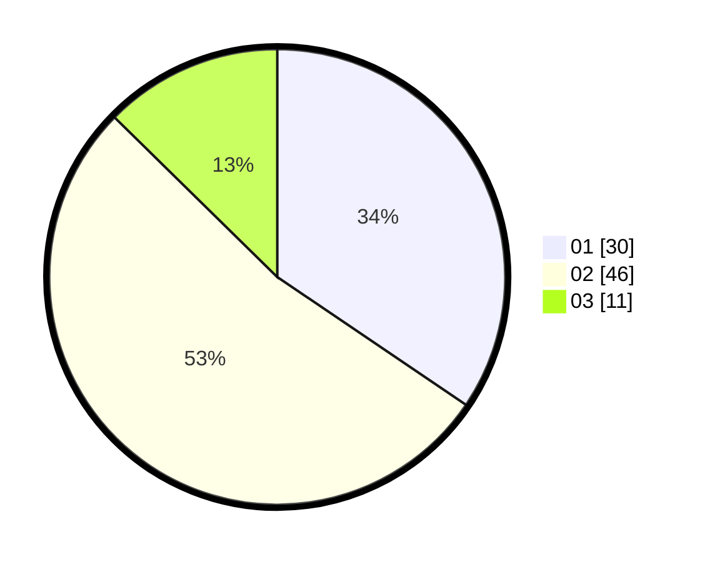

# Hasil

Hasil perolehan suara paslon dapat dilihat pada file paslon-01.txt, paslon-02.txt, dan paslon-03.txt.

Jika tidak ada, artinya data tersebut belum ada pada SIREKAP.

## Perolehan Suara

 * Paslon 01: **30**.
 * Paslon 02: **46**.
 * Paslon 03: **11**.

## Foto C Plano

https://sirekap-obj-formc.kpu.go.id/3bb9/pemilu/ppwp/31/75/10/10/01/3175101001092-20240214-223509--3414b5bd-6bab-4f54-89ea-11cabb3beec3.jpg

https://sirekap-obj-formc.kpu.go.id/3bb9/pemilu/ppwp/31/75/10/10/01/3175101001092-20240214-202408--e6cfebdc-79ae-4e04-90b6-63324296835d.jpg

https://sirekap-obj-formc.kpu.go.id/3bb9/pemilu/ppwp/31/75/10/10/01/3175101001092-20240214-202631--2186e7ab-6110-4d07-9b95-ddd1ed4ea43e.jpg
