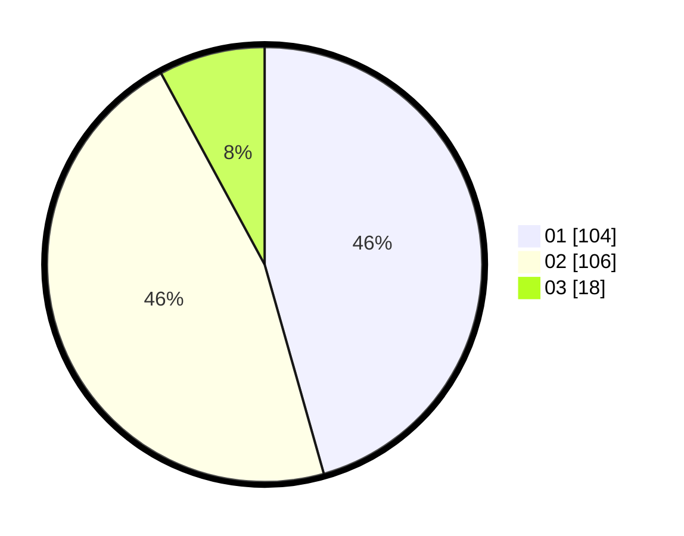

# Hasil

Hasil perolehan suara paslon dapat dilihat pada file paslon-01.txt, paslon-02.txt, dan paslon-03.txt.

Jika tidak ada, artinya data tersebut belum ada pada SIREKAP.

## Perolehan Suara

 * Paslon 01: **104**.
 * Paslon 02: **106**.
 * Paslon 03: **18**.

## Foto C Plano

https://sirekap-obj-formc.kpu.go.id/2e30/pemilu/ppwp/31/75/10/10/02/3175101002009-20240214-222248--ef6394b3-30fd-498e-894e-9a8de267cf10.jpg

https://sirekap-obj-formc.kpu.go.id/2e30/pemilu/ppwp/31/75/10/10/02/3175101002009-20240214-222254--507d6755-3b60-4ce2-a625-f3d366da8855.jpg

https://sirekap-obj-formc.kpu.go.id/2e30/pemilu/ppwp/31/75/10/10/02/3175101002009-20240214-222301--b16da15e-3786-4d85-b79b-f98cfd1e128b.jpg
