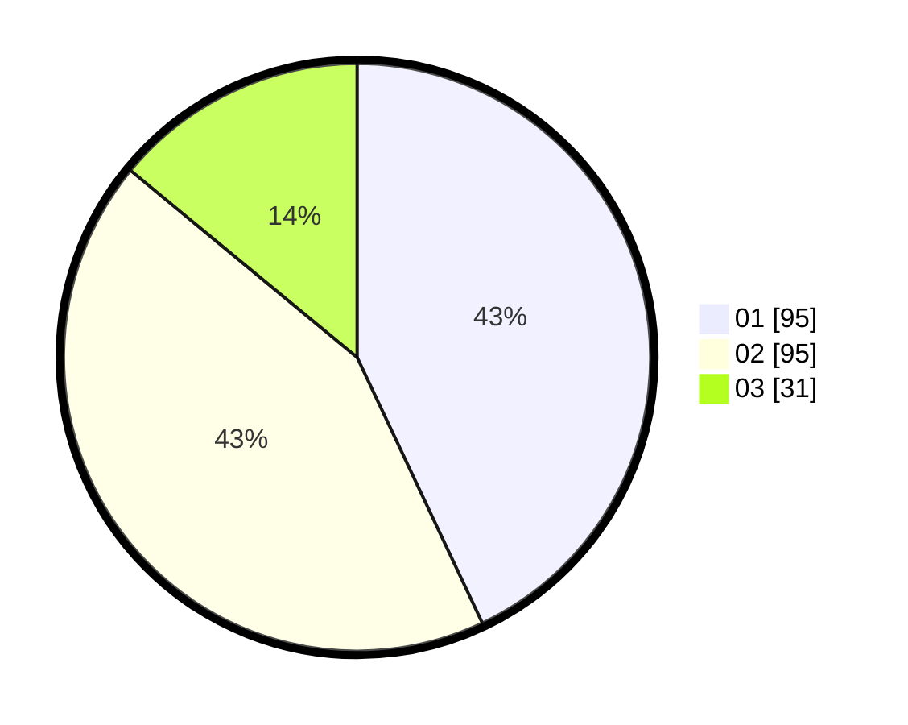

# Hasil

Hasil perolehan suara paslon dapat dilihat pada file paslon-01.txt, paslon-02.txt, dan paslon-03.txt.

Jika tidak ada, artinya data tersebut belum ada pada SIREKAP.

## Perolehan Suara

 * Paslon 01: **95**.
 * Paslon 02: **95**.
 * Paslon 03: **31**.

## Foto C Plano

https://sirekap-obj-formc.kpu.go.id/38ea/pemilu/ppwp/31/75/10/10/02/3175101002012-20240215-020908--3dee89d7-29d3-4743-a31d-b9d4dd0dab5b.jpg

https://sirekap-obj-formc.kpu.go.id/38ea/pemilu/ppwp/31/75/10/10/02/3175101002012-20240215-021031--32942e64-6e12-4f0e-a696-946e634d1735.jpg

https://sirekap-obj-formc.kpu.go.id/38ea/pemilu/ppwp/31/75/10/10/02/3175101002012-20240215-021357--b01e5a5e-f6fa-4c07-b105-e05a60da236f.jpg
