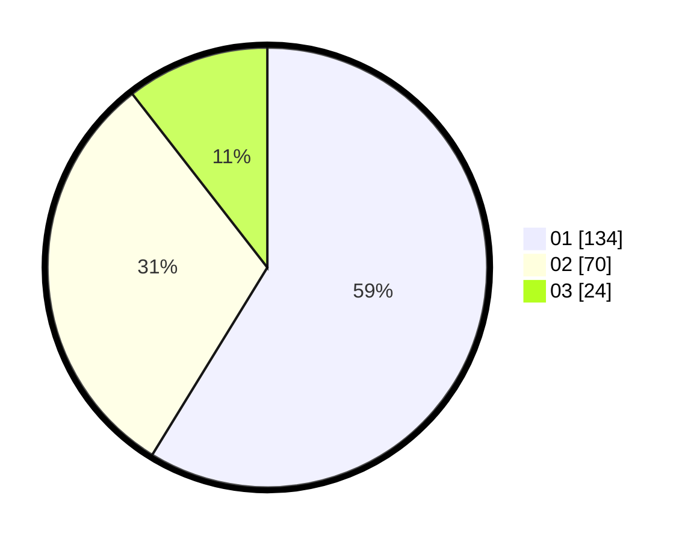

# Hasil

Hasil perolehan suara paslon dapat dilihat pada file paslon-01.txt, paslon-02.txt, dan paslon-03.txt.

Jika tidak ada, artinya data tersebut belum ada pada SIREKAP.

## Perolehan Suara

 * Paslon 01: **134**.
 * Paslon 02: **70**.
 * Paslon 03: **24**.

## Foto C Plano

https://sirekap-obj-formc.kpu.go.id/c441/pemilu/ppwp/31/75/10/10/02/3175101002023-20240214-221259--b400c5ea-81b4-4fd0-a652-eb27f483afe7.jpg

https://sirekap-obj-formc.kpu.go.id/c441/pemilu/ppwp/31/75/10/10/02/3175101002023-20240214-221308--d6b74ce8-48b7-4e10-9a1e-d771976b2308.jpg

https://sirekap-obj-formc.kpu.go.id/c441/pemilu/ppwp/31/75/10/10/02/3175101002023-20240214-221320--2889cb4c-c36c-45fd-ba78-bc93d3542409.jpg
