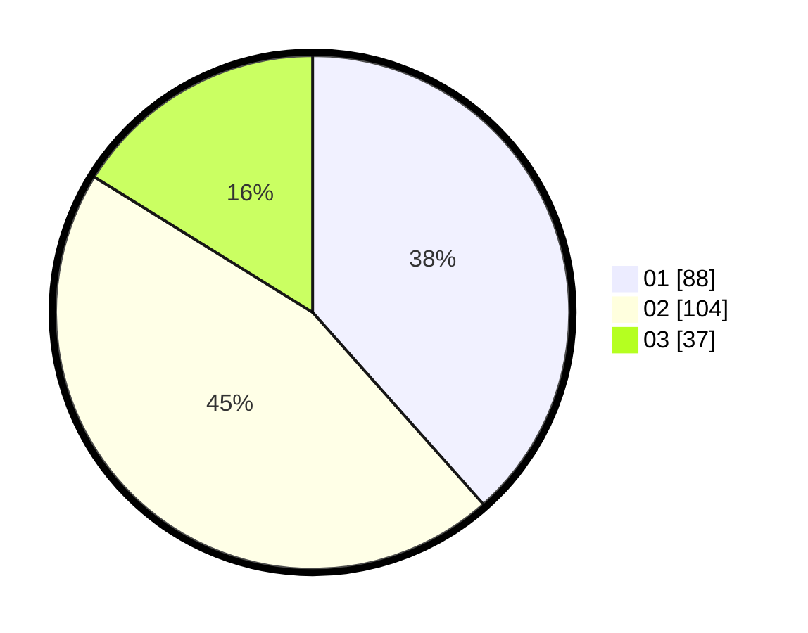

# Hasil

Hasil perolehan suara paslon dapat dilihat pada file paslon-01.txt, paslon-02.txt, dan paslon-03.txt.

Jika tidak ada, artinya data tersebut belum ada pada SIREKAP.

## Perolehan Suara

 * Paslon 01: **88**.
 * Paslon 02: **104**.
 * Paslon 03: **37**.

## Foto C Plano

https://sirekap-obj-formc.kpu.go.id/eefe/pemilu/ppwp/31/75/10/10/02/3175101002026-20240215-204417--86f171f9-f795-443c-94f4-43a5e2cda435.jpg

https://sirekap-obj-formc.kpu.go.id/eefe/pemilu/ppwp/31/75/10/10/02/3175101002026-20240215-204419--83adaf57-d981-44f0-a350-e24b78f5c865.jpg

https://sirekap-obj-formc.kpu.go.id/eefe/pemilu/ppwp/31/75/10/10/02/3175101002026-20240215-204417--7173301c-2a11-4958-a887-207cb8c75513.jpg

## DATA PEMILIH TETAP

Jumlah pemilih dalam DPT: **280**.
 * L: **145**.
 * P: **135**.

## DATA PENGGUNA HAK PILIH

Jumlah pengguna hak pilih dalam DPT: **234**.
 * L: **118**.
 * P: **116**.

Jumlah pengguna hak pilih dalam DPTb: **1**.
 * L: **0**.
 * P: **1**.

Jumlah pengguna hak pilih dalam DPK: **1**.
 * L: **0**.
 * P: **1**.

Jumlah pengguna hak pilih: **236**.
 * L: **118**.
 * P: **118**.

## JUMLAH SUARA SAH DAN TIDAK SAH

JUMLAH SELURUH SUARA SAH: **229**.

JUMLAH SUARA TIDAK SAH: **7**.

JUMLAH SELURUH SUARA SAH DAN SUARA TIDAK SAH: **236**.
