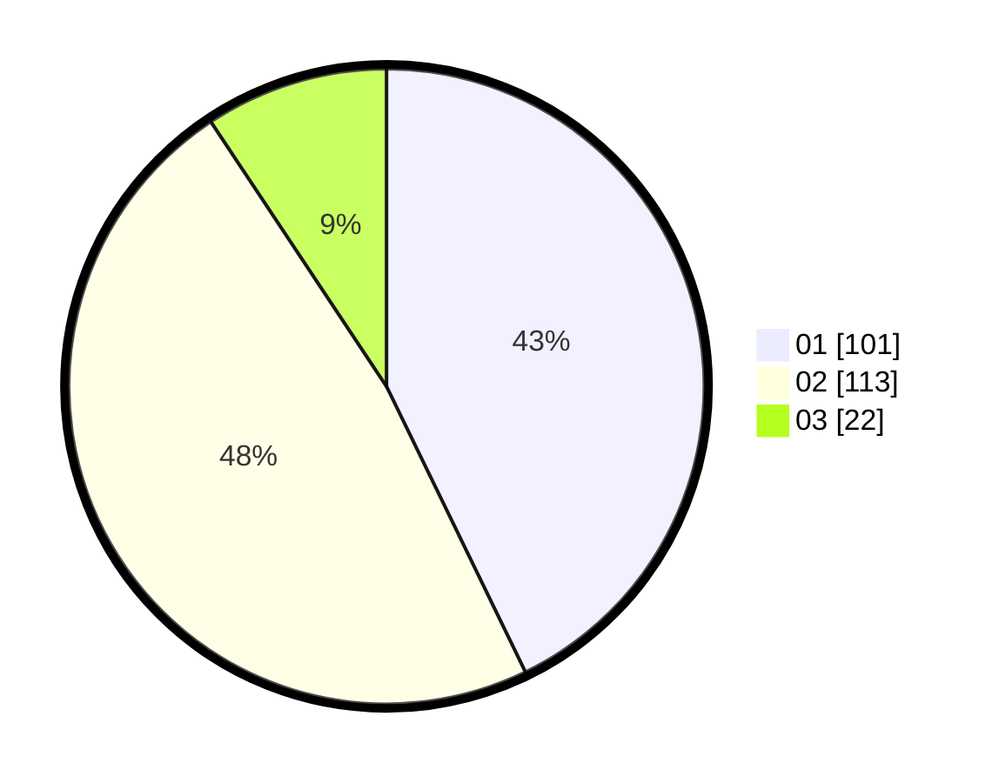

# Hasil

Hasil perolehan suara paslon dapat dilihat pada file paslon-01.txt, paslon-02.txt, dan paslon-03.txt.

Jika tidak ada, artinya data tersebut belum ada pada SIREKAP.

## Perolehan Suara

 * Paslon 01: **101**.
 * Paslon 02: **113**.
 * Paslon 03: **22**.

## Foto C Plano

https://sirekap-obj-formc.kpu.go.id/12c6/pemilu/ppwp/31/75/10/10/02/3175101002034-20240214-191500--a1105ec5-3039-4725-9aba-4a1676b02988.jpg

https://sirekap-obj-formc.kpu.go.id/12c6/pemilu/ppwp/31/75/10/10/02/3175101002034-20240214-194408--ab643718-69d5-41c8-a131-bb00eb23eb13.jpg

https://sirekap-obj-formc.kpu.go.id/12c6/pemilu/ppwp/31/75/10/10/02/3175101002034-20240214-194622--772cf57c-631e-46d8-aed3-4ab332fc1684.jpg
