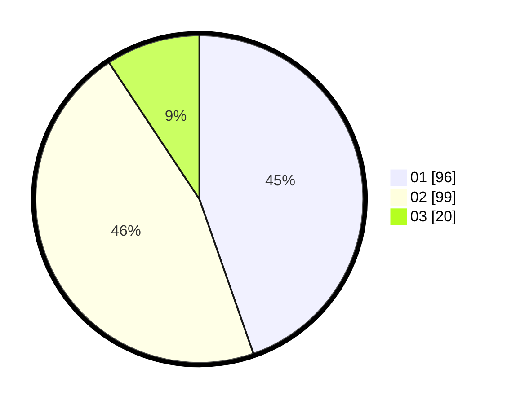

# Hasil

Hasil perolehan suara paslon dapat dilihat pada file paslon-01.txt, paslon-02.txt, dan paslon-03.txt.

Jika tidak ada, artinya data tersebut belum ada pada SIREKAP.

## Perolehan Suara

 * Paslon 01: **96**.
 * Paslon 02: **99**.
 * Paslon 03: **20**.

## Foto C Plano

https://sirekap-obj-formc.kpu.go.id/fdef/pemilu/ppwp/31/75/10/10/02/3175101002035-20240214-191527--3ab53776-8e43-4141-a472-9d35b26a6f85.jpg

https://sirekap-obj-formc.kpu.go.id/fdef/pemilu/ppwp/31/75/10/10/02/3175101002035-20240214-190921--6d6c3c2a-6bba-4074-a15b-d93dbf201baf.jpg

https://sirekap-obj-formc.kpu.go.id/fdef/pemilu/ppwp/31/75/10/10/02/3175101002035-20240214-191214--b46797d4-8ca2-4224-8e24-b2966f267885.jpg

## DATA PEMILIH TETAP

Jumlah pemilih dalam DPT: **264**.
 * L: **120**.
 * P: **144**.

## DATA PENGGUNA HAK PILIH

Jumlah pengguna hak pilih dalam DPT: **215**.
 * L: **94**.
 * P: **121**.

Jumlah pengguna hak pilih dalam DPTb: **0**.
 * L: **0**.
 * P: **0**.

Jumlah pengguna hak pilih dalam DPK: **1**.
 * L: **1**.
 * P: **0**.

Jumlah pengguna hak pilih: **216**.
 * L: **95**.
 * P: **121**.

## JUMLAH SUARA SAH DAN TIDAK SAH

JUMLAH SELURUH SUARA SAH: **215**.

JUMLAH SUARA TIDAK SAH: **1**.

JUMLAH SELURUH SUARA SAH DAN SUARA TIDAK SAH: **216**.
