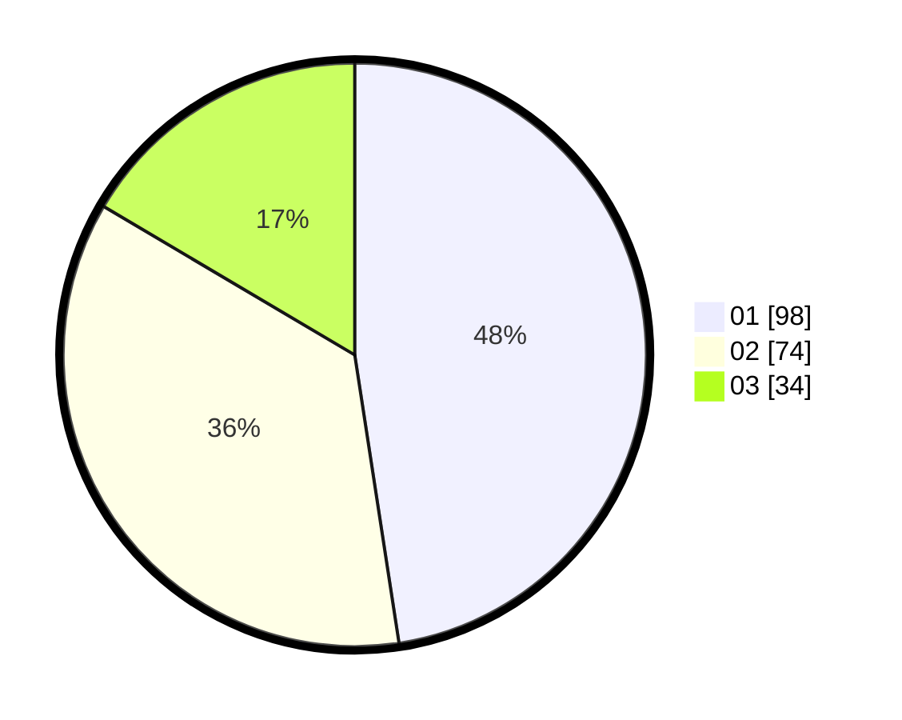

# Hasil

Hasil perolehan suara paslon dapat dilihat pada file paslon-01.txt, paslon-02.txt, dan paslon-03.txt.

Jika tidak ada, artinya data tersebut belum ada pada SIREKAP.

## Perolehan Suara

 * Paslon 01: **98**.
 * Paslon 02: **74**.
 * Paslon 03: **34**.

## Foto C Plano

https://sirekap-obj-formc.kpu.go.id/4be5/pemilu/ppwp/31/75/10/10/02/3175101002039-20240214-204211--9d5d2cd5-d8b5-4a74-b194-7da9542c9691.jpg

https://sirekap-obj-formc.kpu.go.id/4be5/pemilu/ppwp/31/75/10/10/02/3175101002039-20240214-194050--b9170756-321c-41ad-9d37-cae686d60932.jpg

https://sirekap-obj-formc.kpu.go.id/4be5/pemilu/ppwp/31/75/10/10/02/3175101002039-20240214-194333--7badb3bf-42a4-4cc9-9246-f830cfd2fe91.jpg
