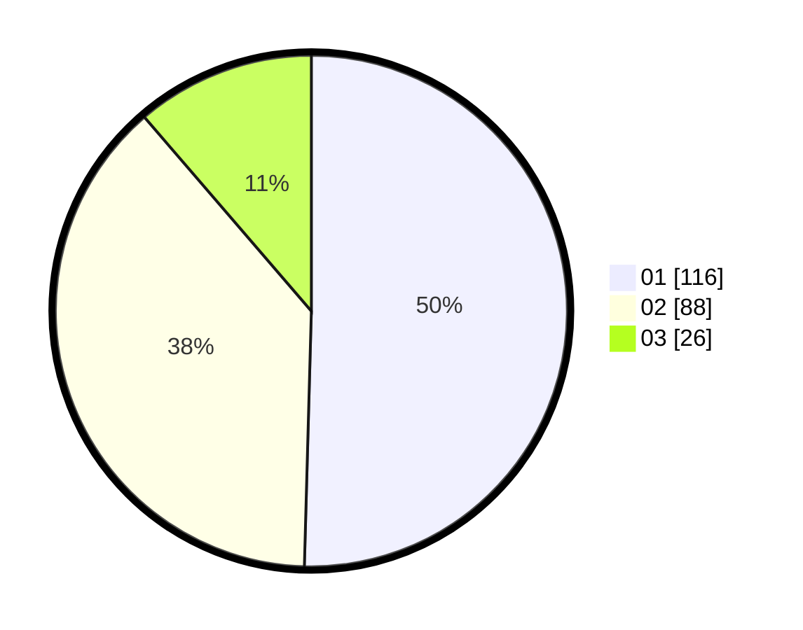

# Hasil

Hasil perolehan suara paslon dapat dilihat pada file paslon-01.txt, paslon-02.txt, dan paslon-03.txt.

Jika tidak ada, artinya data tersebut belum ada pada SIREKAP.

## Perolehan Suara

 * Paslon 01: **116**.
 * Paslon 02: **88**.
 * Paslon 03: **26**.

## Foto C Plano

https://sirekap-obj-formc.kpu.go.id/e31c/pemilu/ppwp/31/75/10/10/02/3175101002049-20240215-164437--e9da54f9-da6e-409f-b1c9-d54a4047a611.jpg

https://sirekap-obj-formc.kpu.go.id/e31c/pemilu/ppwp/31/75/10/10/02/3175101002049-20240215-164727--dda1a084-da81-4196-bfa4-88435b9f5302.jpg

https://sirekap-obj-formc.kpu.go.id/e31c/pemilu/ppwp/31/75/10/10/02/3175101002049-20240215-164840--186e63eb-5570-4b16-89b4-0d0a26e2e6f5.jpg

## DATA PEMILIH TETAP

Jumlah pemilih dalam DPT: **287**.
 * L: **136**.
 * P: **151**.

## DATA PENGGUNA HAK PILIH

Jumlah pengguna hak pilih dalam DPT: **224**.
 * L: **103**.
 * P: **121**.

Jumlah pengguna hak pilih dalam DPTb: **0**.
 * L: **0**.
 * P: **0**.

Jumlah pengguna hak pilih dalam DPK: **9**.
 * L: **1**.
 * P: **8**.

Jumlah pengguna hak pilih: **233**.
 * L: **104**.
 * P: **129**.

## JUMLAH SUARA SAH DAN TIDAK SAH

JUMLAH SELURUH SUARA SAH: **230**.

JUMLAH SUARA TIDAK SAH: **3**.

JUMLAH SELURUH SUARA SAH DAN SUARA TIDAK SAH: **233**.
