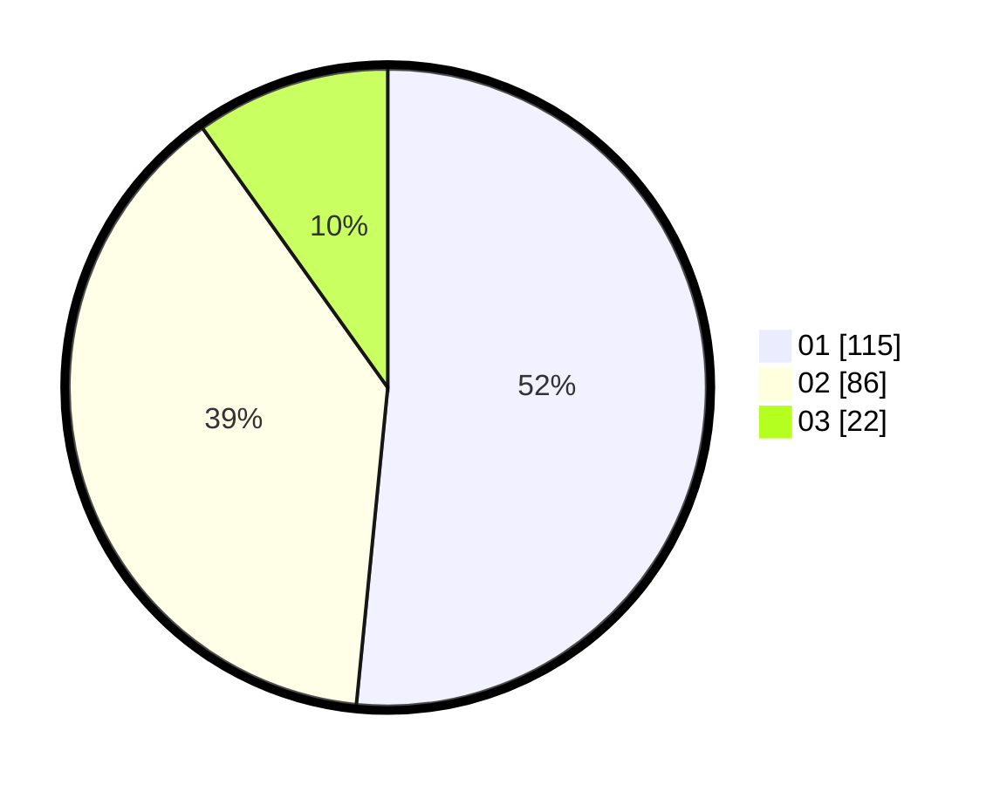

# Hasil

Hasil perolehan suara paslon dapat dilihat pada file paslon-01.txt, paslon-02.txt, dan paslon-03.txt.

Jika tidak ada, artinya data tersebut belum ada pada SIREKAP.

## Perolehan Suara

 * Paslon 01: **115**.
 * Paslon 02: **86**.
 * Paslon 03: **22**.

## Foto C Plano

https://sirekap-obj-formc.kpu.go.id/dab0/pemilu/ppwp/31/75/10/10/02/3175101002055-20240215-083323--2892dfc7-535e-4000-8d4f-45a2ed360fea.jpg

https://sirekap-obj-formc.kpu.go.id/dab0/pemilu/ppwp/31/75/10/10/02/3175101002055-20240215-083344--a8928bf8-6d9f-4e89-a15d-dc1e9182bec6.jpg

https://sirekap-obj-formc.kpu.go.id/dab0/pemilu/ppwp/31/75/10/10/02/3175101002055-20240215-083334--a0ddb287-3acc-4569-a709-42dfedeee1ca.jpg

## DATA PEMILIH TETAP

Jumlah pemilih dalam DPT: **286**.
 * L: **132**.
 * P: **154**.

## DATA PENGGUNA HAK PILIH

Jumlah pengguna hak pilih dalam DPT: **221**.
 * L: **96**.
 * P: **125**.

Jumlah pengguna hak pilih dalam DPTb: **5**.
 * L: **3**.
 * P: **2**.

Jumlah pengguna hak pilih dalam DPK: **0**.
 * L: **0**.
 * P: **0**.

Jumlah pengguna hak pilih: **226**.
 * L: **99**.
 * P: **127**.

## JUMLAH SUARA SAH DAN TIDAK SAH

JUMLAH SELURUH SUARA SAH: **223**.

JUMLAH SUARA TIDAK SAH: **3**.

JUMLAH SELURUH SUARA SAH DAN SUARA TIDAK SAH: **226**.
