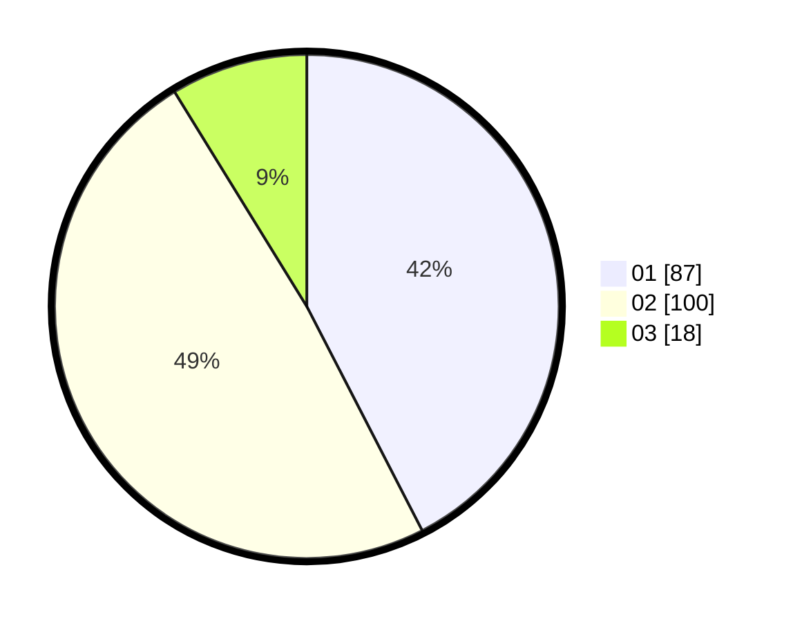

# Hasil

Hasil perolehan suara paslon dapat dilihat pada file paslon-01.txt, paslon-02.txt, dan paslon-03.txt.

Jika tidak ada, artinya data tersebut belum ada pada SIREKAP.

## Perolehan Suara

 * Paslon 01: **87**.
 * Paslon 02: **100**.
 * Paslon 03: **18**.

## Foto C Plano

https://sirekap-obj-formc.kpu.go.id/a57f/pemilu/ppwp/31/75/10/10/02/3175101002056-20240215-180037--af6ef941-4165-4e13-83ca-e8668f7fedc2.jpg

https://sirekap-obj-formc.kpu.go.id/a57f/pemilu/ppwp/31/75/10/10/02/3175101002056-20240215-180058--1290e4c8-8024-44fa-a098-8425fe311dce.jpg

https://sirekap-obj-formc.kpu.go.id/a57f/pemilu/ppwp/31/75/10/10/02/3175101002056-20240215-180047--35a9c84b-595d-410f-9595-8de9d0583f1b.jpg

## DATA PEMILIH TETAP

Jumlah pemilih dalam DPT: **264**.
 * L: **121**.
 * P: **143**.

## DATA PENGGUNA HAK PILIH

Jumlah pengguna hak pilih dalam DPT: **194**.
 * L: **79**.
 * P: **115**.

Jumlah pengguna hak pilih dalam DPTb: **3**.
 * L: **1**.
 * P: **2**.

Jumlah pengguna hak pilih dalam DPK: **9**.
 * L: **2**.
 * P: **7**.

Jumlah pengguna hak pilih: **206**.
 * L: **82**.
 * P: **124**.

## JUMLAH SUARA SAH DAN TIDAK SAH

JUMLAH SELURUH SUARA SAH: **205**.

JUMLAH SUARA TIDAK SAH: **1**.

JUMLAH SELURUH SUARA SAH DAN SUARA TIDAK SAH: **206**.
