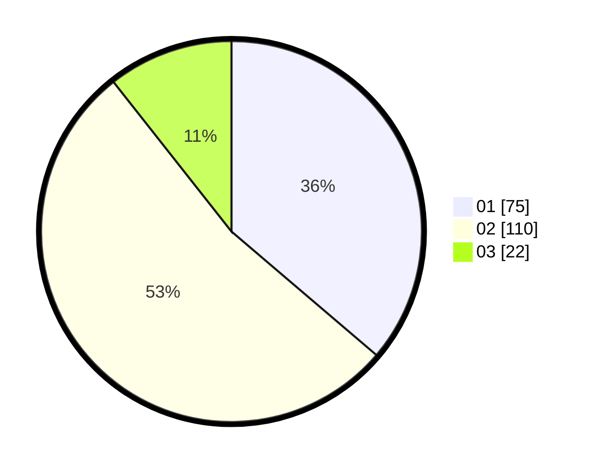

# Hasil

Hasil perolehan suara paslon dapat dilihat pada file paslon-01.txt, paslon-02.txt, dan paslon-03.txt.

Jika tidak ada, artinya data tersebut belum ada pada SIREKAP.

## Perolehan Suara

 * Paslon 01: **75**.
 * Paslon 02: **110**.
 * Paslon 03: **22**.

## Foto C Plano

https://sirekap-obj-formc.kpu.go.id/f812/pemilu/ppwp/31/75/10/10/02/3175101002057-20240214-155147--748970fd-267c-44ad-a6cf-cfc3bfa38ab9.jpg

https://sirekap-obj-formc.kpu.go.id/f812/pemilu/ppwp/31/75/10/10/02/3175101002057-20240214-155153--d5816d4d-46b4-48ce-b6c3-435ac9f77938.jpg

https://sirekap-obj-formc.kpu.go.id/f812/pemilu/ppwp/31/75/10/10/02/3175101002057-20240214-185553--3885cabc-9f8b-4fb4-850e-805772c890d4.jpg

## DATA PEMILIH TETAP

Jumlah pemilih dalam DPT: **251**.
 * L: **124**.
 * P: **127**.

## DATA PENGGUNA HAK PILIH

Jumlah pengguna hak pilih dalam DPT: **203**.
 * L: **94**.
 * P: **109**.

Jumlah pengguna hak pilih dalam DPTb: **3**.
 * L: **2**.
 * P: **1**.

Jumlah pengguna hak pilih dalam DPK: **5**.
 * L: **2**.
 * P: **3**.

Jumlah pengguna hak pilih: **211**.
 * L: **98**.
 * P: **113**.

## JUMLAH SUARA SAH DAN TIDAK SAH

JUMLAH SELURUH SUARA SAH: **207**.

JUMLAH SUARA TIDAK SAH: **4**.

JUMLAH SELURUH SUARA SAH DAN SUARA TIDAK SAH: **211**.
